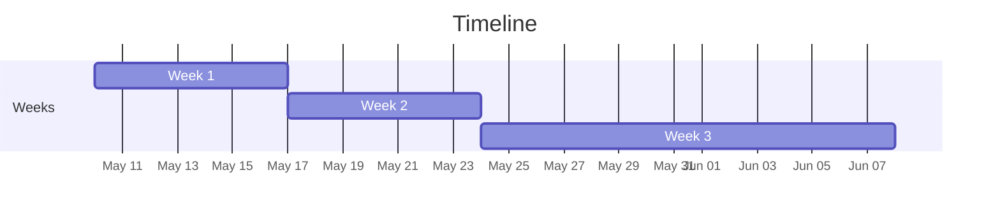

# Calendar and Timeline
## Overview

| Week | Start | End | Duration |
|------|-------|-----|----------|
| Week 1 | May 10 | May 17 | 7 days |
| Week 2 | May 17 | May 24 | 7 days |
| Week 3 | May 24 | June 8 | 15 days |

## Timeline

