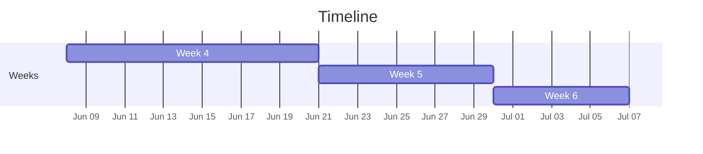

# Calendar & Timeline

## Overview

|Week|Start|End|Duration|
|---|---|---|---|
|Week 4|June 8|June 21|13 days|
|Week 5|June 21|June 30|9 days|
|Week 6|June 30|July 7|7 days|

## Timeline

```mermaid
gantt
    title Timeline
    dateFormat YYYY-MM-DD
    axisFormat %b %d
    section Weeks
    Week 4 :w4, 2026-06-08, 2026-06-21
    Week 5 :w5, 2026-06-21, 2026-06-30
    Week 6 :w6, 2026-06-30, 2026-07-07
```
