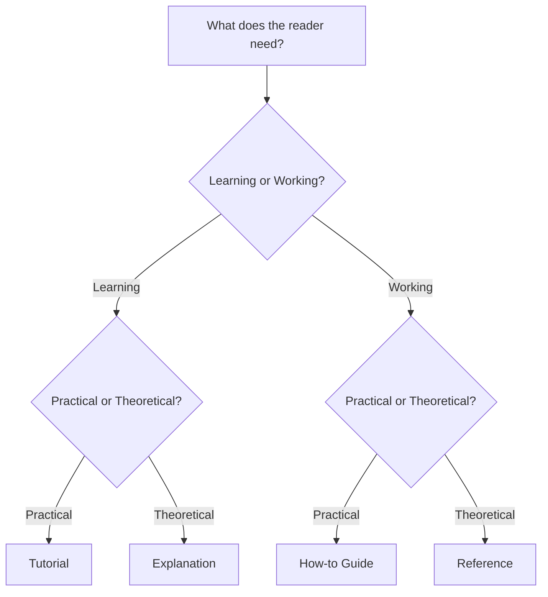

## Core Idea
> Documentation is not one task — it's four distinct tasks, each serving a
> different reader need. Most bad docs result from mixing these needs in a
> single document.

Created by **Daniele Procida**. Adopted by Cloudflare, Canonical/Ubuntu,
Gatsby, Django, and others.

## The Two Underlying Axes
Diátaxis isn't an arbitrary list — it's derived from crossing two axes:

- **Action vs. Cognition** — is the reader *doing* something, or trying to
  *understand* something?
- **Acquisition vs. Application** — is the reader *learning* (no real task
  yet), or *working* (applying existing knowledge to a real task)?

| | Learning (acquisition) | Working (application) |
|---|---|---|
| **Practical (action)** | Tutorial | How-to guide |
| **Theoretical (cognition)** | Explanation | Reference |

## The Four Types

### 1. Tutorial — "I want to learn"
- **Mode:** Practical + Learning
- **Voice:** A teacher holding your hand
- **Reader state:** Beginner, trusts author, follows exact steps
- **Rule:** Remove all decisions — one path, always works
- **Example:** "Build your first Flask app"
- **Goal type:** Manufactured/safe goal chosen by the *author*

### 2. How-to Guide — "I want to solve a specific problem"
- **Mode:** Practical + Working
- **Voice:** A recipe
- **Reader state:** Already competent, has a real goal *right now*
- **Rule:** Can present choices; skip foundational teaching
- **Example:** "How to deploy Flask to AWS Lambda"
- **Goal type:** Real goal chosen by the *reader*

> [!important] Tutorial vs. How-to — the #1 confusion
> Both look like step-by-step instructions. The difference is **context**:
> - Tutorial → fabricated goal, for learning, zero decisions
> - How-to → real goal, for working, decisions allowed

### 3. Reference — "I want to look something up"
- **Mode:** Theoretical + Working
- **Voice:** An encyclopedia / dictionary
- **Reader state:** Mid-task, needs a fast fact
- **Rule:** No narrative — structured for scanning (Ctrl+F), mirrors software structure
- **Example:** Full API surface of `Flask.Request`
- **Judged by:** Accuracy + completeness, not readability

### 4. Explanation — "I want to understand"
- **Mode:** Theoretical + Learning
- **Voice:** An essay
- **Reader state:** Not working — building a mental model for the future
- **Rule:** Can discuss history, trade-offs, alternatives, opinions
- **Example:** "Why Flask uses WSGI"
- **Only type where tangents are appropriate**

## The Central Rule: Don't Mix Types
- Decide which of the 4 a document is — **ruthlessly cut** content
  belonging to the other 3
- Don't delete that content — **link to it** instead
  (e.g. Tutorial → "want to understand why? see [[Explanation - Why WSGI]]")
- Mixing types forces a **cognitive mode-switch** on the reader mid-task,
  which is the root cause of confusing docs

## Why Mixing Is Harmful (Not Just Messy)
- Tutorial reader = "trust and execute" mode → dropping in theory breaks focus
- Reference reader = "scan for fact" mode → dropping in a story is noise
- Each reader mode has different expectations for pacing, tone, and depth

## Real-World Proof
- Django docs are explicitly split into: Tutorial / How-to guides /
  Reference / Topics (their name for Explanation)
- This is why Django's docs feel unusually easy to navigate — you know
  *what kind* of help you're getting before you click

## Common Misconceptions
- Tutorial and How-to are NOT the same just because both are step-by-step
- Reference is NOT "beginner docs" and Explanation is NOT "advanced docs" (they're not a ladder)
- A well-organized single doc CANNOT serve all four purposes (mode-switching breaks flow)
- This does NOT only apply to "docs sites" — it applies to READMEs, wikis, onboarding guides too

## Quick Decision Flowchart

## One-Line Takeaway
> Figure out which of the 4 modes your reader is in, write only for that
> mode, and link — never inline — anything that belongs to another mode.

