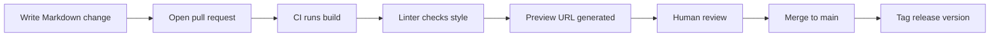

## Core Idea
> Documentation should be treated as a first-class citizen of the codebase
> — plain text, stored in Git alongside the code, pushed through the exact
> same quality pipeline as code: pull requests, automated builds, and
> versioning. The tools that keep code reliable keep docs reliable too.

## The Problem It Solves
- Traditionally: code lived in Git (reviewed, tested, versioned) while
  docs lived in wikis/Google Docs/Confluence (no review, no automated
  checks, no real versioning)
- Result: code evolved carefully, docs drifted out of sync and rotted
  silently until a user complained

## Background: What Is CI?
**CI = Continuous Integration.** Every time someone proposes a change
(a pull request), an automated process runs checks — does it build? do
tests pass? does the linter approve? — *before* a human reviews it. If a
check fails, the change is blocked from merging.

> [!important] Key insight
> CI doesn't care whether it's checking `.py` files or `.md` files — it
> just runs commands and reports pass/fail. The same machinery that
> checks "does this code compile" can check "does this doc site build"
> or "does this paragraph violate the style guide."

## The Four Pillars

### 1. Pull Request Workflow — doc changes get reviewed
- A PR is a proposed change sitting in a staging area before merging
- Without PRs: wiki edits happen silently, no record of who/why/whether
  anyone competent reviewed for accuracy
- With PRs: every doc change gets a second pair of eyes — same scrutiny
  as code
- **Connects to Diátaxis + Style Guide:** a reviewer can catch "this
  tutorial has a reference dump in it" or "this heading is Title Case"
  *before* it reaches readers

### 2. CI Builds With Preview URLs
- Every PR triggers an automatic build of the **entire doc site** at a
  temporary, shareable URL — before merging
- **Why it matters:** raw text diffs can't show you if a table renders
  correctly, a diagram looks right, or navigation feels good. A preview
  URL gives a fully rendered, clickable version of the whole site as if
  already live
- Catches *rendering* errors (broken images, malformed tables, broken
  links) — not just wording errors
- **Tools:** Netlify, Vercel, Cloudflare Pages — all auto-detect PRs,
  run a build command, host at a unique temp URL, free for small/OSS
  projects

### 3. Versioning
- Docs are tagged to match specific software releases (v1.0 docs,
  v2.0 docs) — **all** historical versions stay accessible
- **Why it matters:** if docs only show the latest version's behavior,
  every user on an older version gets actively wrong information —
  worse than no docs at all, because it looks authoritative
- **Why "docs as code" enables this for free:** Git already has tags/
  branches for release snapshots — since docs live in the same repo as
  code, tagging a release automatically captures an accurate doc
  snapshot for that exact version

### 4. Linting
- A linter automatically scans for style violations and can **fail the
  CI build** if found, blocking the PR until fixed
- **Direct enforcement of the Google Style Guide rules:** flag "simply,"
  "just," "easy," passive voice, Title Case headings — automatically,
  every time, with zero human fatigue
- Just another check inside the same CI pipeline as "does the site build"

## Two Stacks Compared

### MkDocs Material
- **Language:** Python
- **Config:** single YAML file — extremely low ceremony
- **Adopters:** FastAPI, Pydantic (both Python projects — fits their
  existing ecosystem)
- **Best for:** simple, beautiful, fast setup, no deep customization needed
- Note: "Material" = a popular third-party theme styled after Google's
  Material Design, giving polish with zero custom CSS

### Docusaurus
- **Language:** React (JavaScript)
- **Notable feature:** native versioning support (built-in, not manual)
- **MDX:** "Markdown + JSX" — embed live interactive React components
  directly inside Markdown (code sandboxes, live charts, widgets)
- **Adopters:** React, Babel, Jest (all JS ecosystem projects)
- **Best for:** heavy customization, native multi-version docs, rich
  interactive elements

> [!note] General rule of thumb
> Documentation tooling tends to match the language ecosystem of the
> underlying project — minimizes the number of toolchains a contributor
> needs to learn.

## Minimal MkDocs Config, Explained Line by Line

```yaml
site_name: My Project
theme:
  name: material
nav:
  - Home: index.md
  - Tutorial: tutorial.md
  - Reference: reference.md
```

- `site_name` — title shown in browser tab and site header
- `theme: name: material` — use the Material theme
- `nav` — defines the sidebar structure, mapping labels to actual
  Markdown files in the `docs/` folder

> [!important] Diátaxis in action
> The nav explicitly separates "Tutorial" and "Reference" into distinct
> entries — the tool itself nudges you toward keeping documentation
> types physically separate, matching the Diátaxis framework.

**Hot-reloading** = saving a Markdown file automatically updates the
browser preview without manual refresh — same convenience as live-reload
in modern code editors, applied to docs.

## Running It on EndeavourOS (zsh)

```zsh
# Install MkDocs Material via pip (recommend a virtual environment)
python -m venv .venv
source .venv/bin/activate
pip install mkdocs-material

# Serve the docs with hot-reloading
mkdocs serve
```

Site available at `localhost:8000`, rebuilds automatically on save.

## Common Misconceptions
- ❌ "Docs as code just means writing docs in Markdown" — Markdown is
  necessary but not sufficient; the core is the *workflow* (PR review,
  CI, linting, versioning)
- ❌ "CI for docs just checks spelling" — it verifies the site builds
  correctly (no broken links/syntax) and enforces style rules via linting
- ❌ "Versioning just means keeping old files around" — it means readers
  can *actively choose and view* the exact historical version matching
  their software version
- ❌ "MkDocs and Docusaurus are interchangeable" — they target different
  ecosystems (Python simplicity vs. React interactivity/native
  versioning); choice should follow the project's language ecosystem

## Plain-Language Summary
Docs as code means giving documentation the same disciplined workflow
code already has: changes go through pull request review, an automated
system builds a live preview of the whole site so reviewers see the real
rendered result, style rules are enforced automatically by linters, and
every past release's docs stay permanently accessible in an accurate
version — all made possible by storing docs as plain text in the same
Git repo as the code they describe.

## Quick Reference: The Docs-as-Code Pipeline




