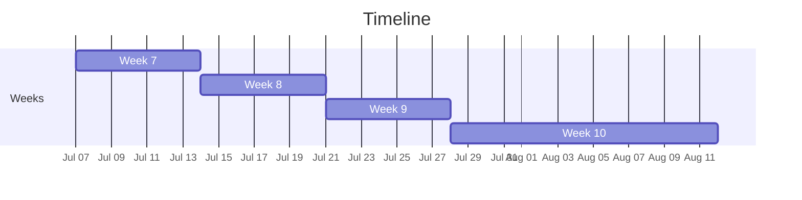

# Calendar & Timeline

## Overview

|Week|Start|End|Duration|
|---|---|---|---|
|Week 7|July 7|July 14|7 days|
|Week 8|July 14|July 21|7 days|
|Week 9|July 21|July 28|7 days|
|Week 10|July 28|August 12|15 days|

## Timeline

