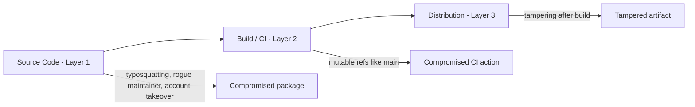

## Core Idea

> [!abstract] Core Idea
> Modern software is built mostly from **other people's code**. The "supply chain" is the full chain of dependencies + build tools + distribution channels involved in getting code from someone else's repo into your running application. Every link is a potential attack point.

## Why This Matters

- Average npm app: **1,000+ transitive dependencies**
- Average Python web app: **200+ transitive dependencies**
- **Transitive dependency** = a dependency of a dependency (you never chose it directly)
- More dependencies = larger **attack surface** (every dependency is a "door" someone else built the lock for)

---

## The Three Layers

### 1. Dependency-on-Itself Attacks

> [!danger] Definition
> A package you already trust turns malicious.

- **Typosquatting**
  - Malicious package published under a name similar to a popular one
  - Example: `colors.js` vs `colours.js`
  - Exploits typos / registry namespace being open to anyone
- **Protestware (rogue maintainer)**
  - Legitimate maintainer intentionally sabotages their own package
  - Example: **node-ipc (2022)** — wiped files / added protest messages for users geolocated to Russia/Belarus
  - Hard to defend against: attacker *is* the trusted party, no "breach" occurs
- **Account / domain takeover**
  - Attacker gains control of publishing rights without original author's fault
  - Example: **xz/liblzma backdoor (2024)** — attacker spent years building trust as co-maintainer, then inserted an SSH remote-code-execution backdoor; caught by luck (unusual CPU usage noticed)
  - Related trick: expired personal domains can let attackers reset linked registry accounts

> [!tip] Defense Direction
> Vet dependencies, pin exact versions, monitor for maintainer changes, use lockfiles.

---

### 2. Build-Process Attacks

> [!danger] Definition
> Your CI/CD pipeline itself gets compromised — even if your dependencies are clean.

- **CI (Continuous Integration)** = automated pipeline that fetches deps, builds, tests, and publishes your software (the "factory floor")
- **Vulnerability: mutable refs**
  - `uses: someaction@main` → `main` branch can change anytime, silently, without your consent
  - Safer options:
    - `@v1.2.3` (tag — better, but still movable by repo owner)
    - `@<commit-sha>` (**immutable**, safest — locks to exact code)
- **Example: tj-actions/changed-files (2024)**
  - Popular GitHub Action compromised
  - Dumped CI secrets into build logs
  - Hundreds of repos affected simultaneously (supply chain amplification)

> [!tip] Defense Direction
> Pin GitHub Actions / CI steps to commit hashes, minimize CI secret exposure, audit third-party CI steps.

---

### 3. Distribution Attacks

> [!danger] Definition
> The built artifact is tampered with **after** build, before reaching the user.

- Analogy: factory ships a clean product, but the delivery truck is intercepted and the box swapped
- **Defense: Signing**
  - Cryptographically proves:
    - **Authenticity** — really came from the claimed source
    - **Integrity** — hasn't been altered since signing
  - **Sigstore**: modern signing framework
    - No long-lived private keys to manage (identity-based, short-lived signing via GitHub/Google login)
    - Publishes to a **public transparency log** (auditable forever)
    - Enables automated verification at install/deploy time

> [!tip] Defense Direction
> Sign all published artifacts, verify signatures before deploying/installing.

---

## Comparison Table

| Layer | Attack Point | Example | Defense |
|---|---|---|---|
| 1. Dependency-on-itself | Source code of a dependency | xz backdoor, node-ipc protestware, colors.js typosquat | Vetting, pinning versions, lockfiles |
| 2. Build-process | CI/CD pipeline | tj-actions/changed-files via `@main` | Pin to commit SHA, limit CI secrets |
| 3. Distribution | Post-build artifact transit | Tampered published package/image | Signing (Sigstore) |

---

## Common Misunderstandings

> [!failure] Misconceptions
> - "Only direct dependencies matter" → most risk is **transitive**
> - "Clean code = safe software" → CI/build process is also an attack surface
> - "Signing prevents malicious code" → it only proves authenticity/integrity, not that the content is safe
> - "Version tags are fully safe" → tags can be moved; only commit hashes are immutable
> - "Protestware is a hack" → it's abuse of legitimate access, not a breach

---

## Plain-Language Summary

> [!summary]
> Your software isn't just *your* code — it's a giant web of trust involving thousands of strangers' code (**Layer 1**), the automated systems that assemble it (**Layer 2**), and the channels that deliver it to you (**Layer 3**). A real security strategy has to address **all three**, because attackers will simply go for whichever layer is weakest. Pin your dependencies and CI actions to immutable references, vet your maintainers, and sign/verify your final artifacts with tools like Sigstore.
