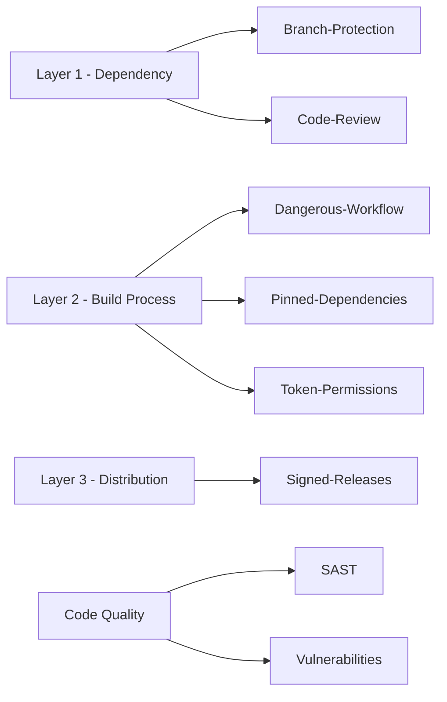

## Core Idea

> [!abstract] Core Idea
> **OpenSSF Scorecard** automatically inspects a public GitHub repository and produces a **0–10 security health score**, based on 18+ checks. It doesn't prove the code is bug-free — it measures whether the project *follows practices* known to reduce supply-chain risk. Think of it as a nutrition label, not a taste test.

## Background

- **OpenSSF** = Open Source Security Foundation (Linux Foundation project) — builds free tools to make open-source security practices *measurable*, since anyone can publish a package and nobody is required to follow best practices.
- Scorecard's checks map almost 1:1 onto the **three supply chain layers**:
  1. Dependency-on-itself (malicious/hijacked package)
  2. Build-process (compromised CI)
  3. Distribution (tampered artifact post-build)

---

## Installing & Running (EndeavourOS / zsh)

Scorecard is written in Go — install Go first via pacman:

```zsh
sudo pacman -S go
```

Ensure Go's bin directory is on PATH (add to `~/.zshrc` if missing):

```zsh
echo 'export PATH=$PATH:$(go env GOPATH)/bin' >> ~/.zshrc
source ~/.zshrc
```

Install Scorecard:

```zsh
go install github.com/ossf/scorecard/v5/cmd/scorecard@latest
```

Run it against a repo:

```zsh
scorecard --repo=github.com/expressjs/express
```

> [!tip] No-install shortcut
> Visit **scorecard.dev** — many popular repos already have a precomputed, cached score, no setup needed.

> [!note] Rate limits
> Set a `GITHUB_AUTH_TOKEN` env variable to avoid GitHub API rate limiting during scans.

---

## The Checks, Explained

### Branch-Protection
- **Checks:** Is `main` protected — no direct pushes, changes require a PR (and approval)?
- **Why it matters:** Without it, one compromised account can push straight to `main` with zero oversight.
- **Layer:** 1 (dependency-on-itself) — e.g. would help catch an xz-style backdoor before merge.

### Code-Review
- **Checks:** Do PRs *actually* get reviewed in practice (checked against real commit history), not just in policy?
- **Why it matters:** A second reviewer is more likely to notice something suspicious the author wouldn't flag.
- **Layer:** 1

### Dangerous-Workflow
- **Checks:** Does CI use `pull_request_target` (full secrets/permissions) combined with checking out and running the **untrusted PR's own code**?
- **Why it matters:**
  - `pull_request` trigger → limited permissions, no secrets (safe for untrusted forks)
  - `pull_request_target` trigger → full permissions + secrets, meant for cases where you don't run the PR's code
  - Combining them = an attacker's PR code runs *with access to your secrets*. One of the most common real-world Actions misconfigurations.
- **Layer:** 2 (build-process)

### Pinned-Dependencies
- **Checks:** Are GitHub Actions pinned by **commit SHA**, not a mutable tag/branch like `@main` or `@v1`?
- **Why it matters:** `@main` can change underneath you anytime; tags can be moved; only a commit SHA is cryptographically immutable. Directly measures whether a project learned the lesson of the tj-actions/changed-files (2024) incident.
- **Layer:** 2

### Signed-Releases
- **Checks:** Are published release artifacts cryptographically signed (e.g., via Sigstore)?
- **Why it matters:** Without signing, there's no way to tell a legitimate release from a tampered one on a compromised mirror/CDN/registry.
- **Layer:** 3 (distribution)

### SAST
- **Checks:** Does the project run static analysis (Scorecard specifically looks for **CodeQL**)?
- **What "static" means:** Examines source code without executing it, modeling data flow to flag known-dangerous patterns (e.g., unsanitized input reaching a DB query).
- **Why it matters:** Catches *unintentional* vulnerabilities/bug classes before shipping — adjacent to supply chain risk, more about general code quality.

### Token-Permissions
- **Checks:** Is the auto-generated `GITHUB_TOKEN` in CI scoped to the minimum permissions needed, or left at broad defaults (write access to contents/packages/deployments)?
- **Why it matters:** Principle of least privilege — if the CI job is ever compromised (via Layer 1 or Layer 2), the attacker only inherits what the token was actually scoped to.
- **Layer:** 2

### Vulnerabilities
- **Checks:** Any known, unpatched CVEs, cross-referenced against **osv.dev**?
- **What osv.dev is:** An aggregated, machine-queryable database of known vulnerabilities across ecosystems (npm, PyPI, Go modules, crates.io, etc.) — similar to CVE but structured for automated tooling.
- **Why it matters:** Direct, reactive signal — is there a currently-known hole that hasn't been patched?

---

## Mapping Table



| Check | Defends Against | Layer |
|---|---|---|
| Branch-Protection | Unauthorized/unreviewed changes to main | 1 |
| Code-Review | Malicious/careless changes slipping through | 1 |
| Dangerous-Workflow | Secret leakage via untrusted PR code execution | 2 |
| Pinned-Dependencies | Mutable Action refs changing underneath you | 2 |
| Token-Permissions | Blast radius if CI is compromised | 2 |
| Signed-Releases | Tampered artifacts post-build | 3 |
| SAST | Unintentional vulnerabilities | Code quality |
| Vulnerabilities | Known, unpatched CVEs | Reactive patching |

---

## Real-World Scenario

Evaluating a new npm dependency:

```zsh
scorecard --repo=github.com/someauthor/some-package
```

If it fails **Pinned-Dependencies** and **Dangerous-Workflow**, that project's CI is exposed to exactly the kind of attack that hit tj-actions/changed-files in 2024 — concrete, actionable info before adopting the dependency (or grounds to open a PR fixing it).

---

## Common Misunderstandings

> [!failure] Misconceptions
> - "High score = bug-free code" → Scorecard measures *process hygiene*, not code correctness
> - "Low score = malicious project" → many safe solo-maintainer projects score low just from lacking formal infrastructure
> - "I need to install it to check any repo" → scorecard.dev has precomputed scores for most popular projects
> - "Dangerous-Workflow only matters to maintainers" → if you depend on a project with this flaw, a successful exploit there can flow into your own build

---

## Plain-Language Summary

> [!summary]
> OpenSSF Scorecard automates a question you'd otherwise have to investigate by hand for every dependency: *does this project actually practice the security hygiene that prevents supply chain attacks?* Its checks map directly onto the three attack layers — review/branch-protection guards against a maintainer or account going rogue, pinned dependencies and safe workflows guard against a hijacked build process, and signed releases guard against post-publication tampering. Not a guarantee, but a fast, evidence-based signal before trusting a new dependency.
