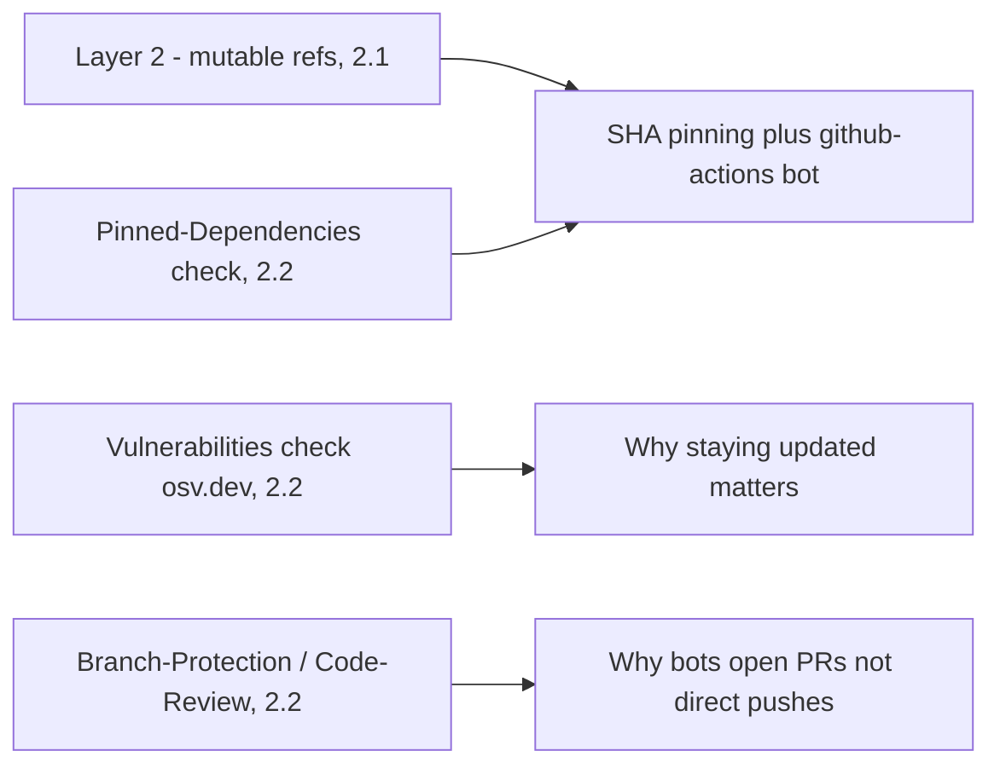

## Core Idea

> [!abstract] Core Idea
> **Dependency update bots** continuously watch your project's dependency manifests (package.json, requirements.txt, GitHub Actions workflows) and automatically open pull requests when newer versions are released. **Dependabot** and **Renovate** are the two dominant free options. Choosing between them is mostly a tradeoff between simplicity and configurability.

## Why Staying Updated Matters (connects to 2.1 / 2.2)

- Recall Scorecard's **Vulnerabilities** check (2.2): a patch existing upstream does nothing if your project never bumps to it
- Attackers actively scan for projects running outdated versions with known, disclosed CVEs — one of the lowest-effort attack vectors that exists
- A dependency bot removes the "nobody got around to it" failure mode by making updates continuous and automatic

## Why Bots Open PRs Instead of Pushing Directly

- Ties to **Branch-Protection** / **Code-Review** (2.2) — even automated changes should go through review
- Protects against: an update breaking something, OR the update itself being malicious (Layer 1 attack from 2.1 — a new "legitimate-looking" version could itself be compromised)

## What is a "package-ecosystem"?

- Different languages have different package managers/manifest formats (npm, pip, Cargo, Bundler, etc.)
- Tells the bot which format/registry to understand when scanning a given directory

---

## Dependabot

- **Built into GitHub** natively (GitHub acquired it in 2019) — no third-party account/app needed
- **Zero-config**: minimum setup is one YAML file, `.github/dependabot.yml`
- **Good defaults**: sensible behavior out of the box without a large config schema
- **One PR per outdated dependency**
  - ✅ Upside: each PR is small, focused, easy to isolate if CI breaks
  - ❌ Downside: doesn't scale well — many outdated deps = wall of individual PRs, noisy for tightly-related packages (e.g. all `@babel/*` packages)

## Renovate

- **Third-party** (made by Mend, formerly WhiteSource) — installed as a GitHub App or self-hosted
- **More configurable**: larger schema (`renovate.json`) — custom scheduling windows, automerge rules, per-package version-bump strategies, changelog rendering, etc.
- **Grouping via `config:base` preset**
  - Presets = shareable, pre-built config bundles (like ESLint's "extends")
  - `config:base` bundles related updates (e.g. all `@types/*` packages) into a single PR instead of one-per-package
- **Supports more package managers** — broader ecosystem coverage, including Helm charts, Terraform, Docker Compose; useful for **polyglot repos** (multiple languages/ecosystems in one repository)
- **Fancier scheduling** — granular time windows (e.g. "only 1am–5am weekdays") vs Dependabot's simpler daily/weekly/monthly options

> [!tip] Default Recommendation
> Default to **Dependabot** — least setup, least cognitive overhead. Switch to **Renovate** only once you hit a concrete pain point: too many noisy individual PRs (grouping) or a polyglot repo (broader ecosystem support).

---

## Minimal Dependabot Config, Explained

```yaml
# .github/dependabot.yml
version: 2
updates:
- package-ecosystem: npm
  directory: /
  schedule: { interval: weekly }
  open-pull-requests-limit: 10
- package-ecosystem: github-actions
  directory: /
  schedule: { interval: weekly }
```

- `version: 2` — current config schema version (boilerplate)
- `updates:` — list of "things to watch," one entry per ecosystem/directory combo
- `package-ecosystem: npm` — watches JS/npm dependencies
- `directory: /` — where the manifest file lives relative to repo root (point at a subfolder for monorepos)
- `schedule: { interval: weekly }` — how often to check for new versions (daily/weekly/monthly)
- `open-pull-requests-limit: 10` — caps concurrent open PRs to prevent an overwhelming flood on first run
- Second entry (`github-actions`) — separate ecosystem watching your CI workflow files, not just app code

---

## Why the `github-actions` Ecosystem Entry Matters

> [!danger] The subtlety
> Even pinning an Action to a tag like `@v4` is NOT fully safe: `v4` typically means "any 4.x.x release," and **the exact commit `v4` resolves to can change** every time a new 4.x version is tagged (standard semantic versioning behavior). If a future release under that tag is compromised (Layer 1/2 attack), you'd have no visibility and no automatic fix path — unless something is watching for new releases.

The `github-actions` Dependabot ecosystem entry watches `.github/workflows/*.yml` files for outdated Action versions, giving your **CI's own dependencies** the same continuous-update treatment as your app code.

### Best practice: pin by commit SHA + let Dependabot track updates

```yaml
- uses: actions/checkout@b4ffde65f46336ab88eb53be808477a3936bae11 # v4.1.1
```

- **Commit SHA** = cryptographically immutable — mathematically impossible to silently change underneath you (unlike a tag or `@main`)
- **Drawback alone:** a hardcoded SHA never auto-updates, even for legitimate security patches
- **Dependabot's `github-actions` ecosystem solves this combo problem**: it understands SHA-pinned references, detects new upstream releases, and opens a PR updating the SHA (plus the human-readable comment, e.g. `# v4.1.1` → `# v4.1.2`)
- Result: immutability **and** a clear, reviewable path to updates — best of both worlds
- The trailing `# v4.1.1` comment exists purely for humans skimming the file (a raw SHA isn't readable) — both bots update this comment automatically alongside the SHA

---

## Connections Back to 2.1 / 2.2



| Concept | From Section | Role Here |
|---|---|---|
| Layer 2: build-process attacks (mutable refs) | 2.1 | The exact problem SHA-pinning + github-actions bot solves together |
| Pinned-Dependencies check | 2.2 | Satisfied by combining SHA pinning with automated update PRs |
| Vulnerabilities check (osv.dev) | 2.2 | Reason staying updated matters at all |
| Branch-Protection / Code-Review | 2.2 | Why bots open PRs instead of pushing directly |

---

## Real-World Scenario

Repo pins `actions/checkout@v4` (tag). Six months later, an attacker compromises that Action's maintainer account and tags a malicious commit as a new `v4.x.y` release. A tag-pinned workflow silently picks up the malicious commit on the next CI run, with zero warning. If instead the repo pinned to a specific SHA **and** had Dependabot's `github-actions` ecosystem active, an explicit PR would appear proposing the SHA bump — giving a real moment to review release notes and decide whether to trust the change before merging.

---

## Common Misunderstandings

> [!failure] Misconceptions
> - "Pinning to `@v4` is as safe as pinning to a SHA" → tags can be repointed by maintainers (or a compromised account); only a SHA is immutable
> - "Dependabot and Renovate do fundamentally different things" → same core purpose (detect outdated deps, open update PRs); differences are in configurability/grouping/ecosystem coverage
> - "Only application dependencies need updates, not CI Actions" → CI's own dependencies (the Actions it calls) are just as much a supply chain risk
> - "SHA-pinning alone means you'll never get security updates" → true only in isolation; combined with a bot's github-actions ecosystem, you get both immutability and update visibility
> - "More config options (Renovate) is strictly better" → more configurability = more setup time and more ways to misconfigure; pick based on actual project complexity

---

## Plain-Language Summary

> [!summary]
> Dependabot and Renovate both automatically open PRs when your dependencies (including GitHub Actions) have newer versions available, replacing "someone has to remember to check" with a continuous automated process. Dependabot is GitHub-native and simple (one PR per outdated dependency); Renovate is more configurable, can group related updates into single PRs, and covers more ecosystems — useful for polyglot repos, at the cost of more setup. Default to Dependabot; switch to Renovate only for a concrete need (grouping or polyglot support). Pin GitHub Actions by commit SHA for true immutability, and pair that with Dependabot's `github-actions` ecosystem so you still get reviewable, timely updates instead of freezing out security patches.
