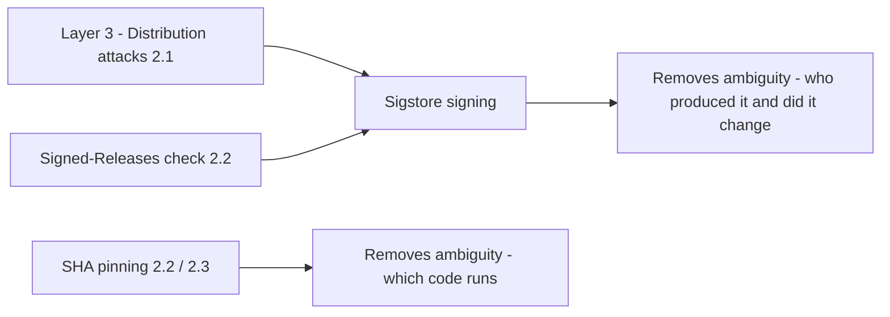

## Core Idea

> [!abstract] Core Idea
> Cryptographic signing lets anyone verify an artifact came from exactly who it claims, and hasn't been altered since. **Sigstore** (Linux Foundation project, co-founded by Google, Red Hat, Chainguard) makes this practical by removing the single biggest reason people never actually signed software before: managing private keys.

## Digital Signing, Mechanically

- **Asymmetric cryptography**: a mathematically linked private key (secret) + public key (shared)
- **Hash function**: one-way "fingerprint" of a file's exact contents — one byte changed = completely different hash
- **Signing**: hash the file, encrypt the hash with the private key → that's the signature
- **Verifying**: decrypt the signature with the public key, independently re-hash the received file, check they match
  - Match = **integrity** (file wasn't altered) + **authenticity** (only the private key holder could produce it)

## Why Traditional Signing (GPG) Failed in Practice

> [!failure] The problem was practice, not math
> - Private key management is a real ongoing burden: generate, protect (ideally on hardware), back up, prevent leaks
> - Key rotation/revocation is painful and rarely done correctly
> - No easy way to tie a key to a *verified* identity — GPG's "web of trust" saw low adoption
> - Constant, front-loaded friction for every maintainer, forever → most open-source packages ended up **unsigned**, leaving Layer 3 (distribution attacks) wide open

## Sigstore's Innovation: "Keyless" Signing

> [!note] What "keyless" actually means
> Keys still exist under the hood. "Keyless" means **you never generate, store, protect, or rotate a long-lived private key yourself** — Sigstore handles the whole key lifecycle, and the key lives for minutes, not years.

**The mechanism:**
1. Authenticate using an identity you already have (GitHub, Google) via OIDC
2. **Fulcio** (Sigstore's certificate authority) issues a short-lived certificate (~10 min) binding a freshly generated ephemeral key pair to your verified identity
3. Sign the artifact immediately, within that window
4. The private key is **discarded** — nothing long-lived to steal, lose, or forget to rotate
5. **Rekor** (Sigstore's transparency log) permanently records the signing event publicly, since there's no long-lived public key to check later

### OIDC — why identity-tying works
- OpenID Connect = the same tech behind "Sign in with Google/GitHub" buttons
- The identity provider (e.g. GitHub) vouches cryptographically that the request really is from an authenticated identity, right now
- Sigstore piggybacks on trust infrastructure that already exists (2FA, account-takeover detection) instead of reinventing it

### Rekor — why a public log is structurally necessary
- Borrowed from **Certificate Transparency** (public logging of every HTTPS cert issued)
- Ephemeral keys mean there's no long-lived public key to fetch later for verification
- Rekor's permanent log entry *is* the mechanism that makes later verification possible
- Bonus: entire signing history is publicly auditable — a fraudulent signing event leaves a permanent, visible trace

---

## Commands (EndeavourOS / zsh)

### Install
```zsh
paru -S cosign
```
or, if using yay:
```zsh
yay -S cosign
```
`cosign` is the CLI that talks to Fulcio (certificates) and Rekor (logging) on your behalf.

### Sign
```zsh
cosign sign-blob --yes ./release.tar.gz --output-signature release.tar.gz.sig
```
- `sign-blob` — signing a generic file (cosign also supports container images)
- `--yes` — skips interactive confirmation (useful in CI)
- `--output-signature` — where the resulting `.sig` file is written
- Opens a browser → OIDC login with GitHub → Fulcio issues ephemeral cert → signs → logs to Rekor, all in one command

### Verify
```zsh
cosign verify-blob \
  --certificate-identity 'https://github.com/your-org/your-repo/.github/workflows/release.yml@refs/tags/v1.0.0' \
  --certificate-oidc-issuer 'https://token.actions.githubusercontent.com' \
  --signature release.tar.gz.sig \
  ./release.tar.gz
```
- `--certificate-identity` — extremely precise: not just "someone from your-org," but *this exact workflow file, triggered by this exact tag*. Possible because GitHub's OIDC token asserts structured facts about the automated context, not just a human identity.
- `--certificate-oidc-issuer` — which identity provider must have vouched for the signer (prevents spoofing via an untrusted provider)
- Confirms: **this artifact was signed by a GitHub Actions run on this exact workflow, at this exact tag** — any tampering, at any step, breaks verification (re-computed hash won't match)

---

## Connections Back to Earlier Sections



| Concept | Connection |
|---|---|
| Layer 3: Distribution attacks (2.1) | Sigstore is the concrete implementation of the "signing" defense named but not explained there |
| Signed-Releases check (2.2) | This is literally what that Scorecard check is looking for |
| SHA pinning (2.2/2.3) | Same philosophy: removing mutability/ambiguity from trust — but for *which code runs* rather than *who produced an artifact* |
| GitHub Actions as CI context (2.3) | Identity-based signing works especially well because it can bind to a precise, reproducible workflow run, not just a fallible human |

---

## Real-World Scenario

A project publishes `release.tar.gz` and signs it via a GitHub Actions workflow. Later, a user downloads what they think is `v1.0.0`, but it was served from a compromised mirror with one byte altered. Running `cosign verify-blob` against the legitimate signature fails immediately — the hash of the tampered file doesn't match what was originally signed — no specialized expertise needed beyond running one command.

---

## Common Misunderstandings

> [!failure] Misconceptions
> - "Keyless means no keys at all" → an ephemeral key still exists briefly during signing; "keyless" means no long-lived key *you* manage
> - "Sigstore invents new cryptography" → same underlying asymmetric-key/hashing principles as GPG; the innovation is identity binding + key lifecycle
> - "Signing guarantees the code is safe" → only proves authenticity/integrity; a compromised or rogue maintainer (Layer 1) can still produce a validly-signed malicious artifact
> - "Anyone can verify without knowing the original signer" → verification requires specifying the *expected* identity/issuer; skipping that only confirms "someone valid signed this," not "the right someone"
> - "Rekor logging is just a nice bonus" → it's structurally required for keyless signing to be verifiable later at all

---

## Plain-Language Summary

> [!summary]
> Digital signing has always relied on solid cryptography, but GPG failed in practice because managing private keys securely was too much burden for most people, so most software went unsigned. Sigstore fixes the *practice*, not the *math*: it issues a certificate binding a freshly generated, short-lived key to your existing GitHub/Google identity, you sign immediately, and the key is discarded — with a permanent public record in Rekor keeping verification possible forever. In CI, this proves not just "a person signed this" but "this exact workflow, at this exact tag, produced this exact artifact" — and any tampering afterward is immediately, mathematically detectable.
