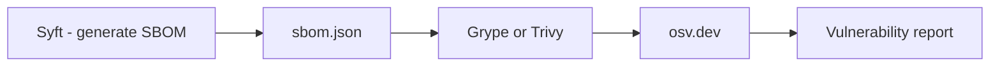

## Core Idea

> [!abstract] Core Idea
> You cannot defend, patch, or audit what you don't know you have. A **Software Bill of Materials (SBOM)** is a structured, machine-readable inventory of every package that went into building your application — direct and transitive. It's the artifact that makes the invisible mass of dependencies (recall: 1,000+ transitive deps in an average npm app) actually visible and enumerable.

## Background: Where the Term Comes From

- Borrowed from manufacturing: a **Bill of Materials (BOM)** lists every raw material/component in a physical product (down to specific screws and chip models)
- Exists so that if a specific part is later found defective, the manufacturer knows exactly which products contain it — without inspecting every unit
- **Software** BOM = same idea applied to code: every package/library/dependency (including transitive ones) compiled or bundled into the final application

## Why It's Necessary

> [!example] Log4Shell (2021)
> A critical vulnerability in the widely-used Java logging library Log4j. Countless organizations spent days/weeks *just figuring out whether they used Log4j at all*, since it was often buried several layers deep as a transitive dependency, with no inventory to check against. SBOMs exist to make "do we use package X at vulnerable version Y anywhere?" answerable in seconds, not weeks.

---

## What's Inside an SBOM

- **Package (name)** — what is present at all
- **Version** — critical because CVEs are version-specific (e.g. "affects 2.0.0–2.14.1"); knowing you use "Log4j" isn't enough, you need the exact version
- **License** — a *legal/compliance* dimension, distinct from security:
  - Licenses (MIT, Apache 2.0, GPL, etc.) impose different obligations
  - Some (GPL, "copyleft") can legally require open-sourcing your own code if incorporated a certain way
  - SBOM license fields let legal/compliance teams audit obligations automatically across 1,000+ dependencies

## Two Formats

| Format | Origin | Historical Focus |
|---|---|---|
| **SPDX** | Linux Foundation | License compliance roots; ISO/IEC 5962:2021 standard |
| **CycloneDX** | OWASP | Security use cases; richer vulnerability data linkage, also covers services/hardware/ML components |

Both are JSON/XML documents describing essentially the same core info (packages, versions, relationships, licenses). Choice is often driven by what downstream tools/regulations expect, not objective superiority.

---

## Generating an SBOM with Syft

**What Syft is:** open-source tool by **Anchore** that scans a directory, container image, or artifact and auto-detects every package by recognizing manifest/lockfiles (`package-lock.json`, `requirements.txt`/`poetry.lock`, `Cargo.lock`, etc.) plus binary analysis for compiled languages.

### Install (EndeavourOS / zsh)

```zsh
paru -S syft-bin
```
or:
```zsh
yay -S syft-bin
```

### Generate

```zsh
syft ./my-app --output cyclonedx-json=sbom.json
```

- `./my-app` — target to scan; can also be a container image (`syft docker:my-app:latest`) — important since container images carry OS-level packages (apt/apk) *in addition to* app-level dependencies
- `--output cyclonedx-json=sbom.json` — output format (CycloneDX) + serialization (JSON) + filename; Syft also supports `spdx-json`, its own native format, human-readable tables, etc.

> [!warning] Never hand-write an SBOM
> Manual tracking is exactly as error-prone as the "nobody can hold 1,000+ dependencies in their head" problem SBOMs exist to solve. Always generate automatically from real build artifacts.

---

## Consuming the SBOM: Grype and Trivy

> [!note] Why the SBOM alone doesn't show vulnerabilities
> An SBOM is just an *inventory* — a snapshot of "what exists." Vulnerability databases (like osv.dev, from section 2.2) update constantly. You need to cross-reference the static inventory against the constantly-changing vulnerability data separately.



- **Grype** (also by Anchore, designed to pair with Syft) — reads an SBOM, cross-references every package/version against vulnerability databases
- **Trivy** (by Aqua Security) — broader scope: SBOMs, container images, filesystems, IaC configs, for both vulnerabilities and misconfigurations

This pipeline is the actual input data that makes Scorecard's **Vulnerabilities check** (section 2.2) computable at all — that check needs exactly this kind of package/version inventory to know what to look up against osv.dev.

---

## Why SBOMs Are No Longer Optional

### Executive Order 14028 (US, May 2021)
- "Improving the Nation's Cybersecurity" — issued in direct response to the **SolarWinds attack (2020)**, where attackers compromised SolarWinds' build process (a real-world **Layer 2** attack, section 2.1) and distributed malware to thousands of orgs, including US federal agencies, via a trusted routine update
- Directed NIST to develop minimum SBOM requirements and required federal agencies to demand SBOMs from software vendors
- Scope: **US government contractors/vendors**, not (yet) all commercial software everywhere

### EU Cyber Resilience Act (adopted 2024)
- Binding EU regulation imposing cybersecurity requirements on products with digital elements sold in the EU
- Much broader scope than EO 14028 — applies to essentially any commercial hardware/software product with digital components sold in the EU
- Includes SBOM-related obligations, enforcement phasing in starting **2027**

> [!important]
> The combined trend: SBOM generation is moving from a voluntary security best-practice to a **baseline legal/compliance requirement** across two of the world's largest software markets.

---

## Connections Back to Sections 2.1–2.4

| Section | Concept | Relationship to SBOM |
|---|---|---|
| 2.1 | 1,000+ transitive dependencies | SBOM makes this invisible mass visible and enumerable |
| 2.1 | Layer 2 build-process attacks (SolarWinds) | Direct real-world cause of the EO 14028 regulatory push |
| 2.2 | Scorecard Vulnerabilities check / osv.dev | SBOM is the necessary input data for this check to work at scale |
| 2.3 | Dependabot/Renovate | Complementary: bots keep deps patched *going forward*; SBOMs give a complete, auditable snapshot of what's deployed *at any point in time* |
| 2.4 | Sigstore signing | Complementary but distinct: signing proves an artifact wasn't tampered with; SBOM proves exactly what's inside it — often want both together |

---

## Real-World Scenario

A critical CVE is disclosed tomorrow in an obscure but widely-used compression library. Without SBOMs, an organization would manually search dozens/hundreds of projects' dependency trees to find where it's used, even transitively. With SBOMs already generated and stored, an automated query via Grype/Trivy across all applications identifies every affected system in minutes — exactly the capability organizations wished they'd had during Log4Shell, and increasingly what regulators now mandate.

---

## Common Misunderstandings

> [!failure] Misconceptions
> - "An SBOM tells you about vulnerabilities directly" → it's just an inventory; needs a scanner (Grype/Trivy) cross-referencing osv.dev
> - "CycloneDX and SPDX are incompatible ideas" → both describe fundamentally similar info; difference is origin/focus (security-first vs license-compliance-first), not core purpose
> - "You should write an SBOM by hand for accuracy" → defeats the purpose; always generate automatically from real build artifacts
> - "SBOM requirements only apply to US government vendors" → true only for EO 14028; the EU CRA is much broader, covering most commercial software/hardware sold in the EU
> - "Generating an SBOM once is enough forever" → dependencies change on every update (ties to 2.3's bots); SBOMs should be regenerated on every build/release, ideally as an automated CI step

---

## Plain-Language Summary

> [!summary]
> An SBOM is a machine-readable inventory of every package, version, and license involved in building your software — necessary because modern apps have far too many transitive dependencies for anyone to track by hand. Syft generates this automatically from real build artifacts in standard formats (CycloneDX, SPDX); Grype and Trivy then cross-reference that inventory against vulnerability databases like osv.dev, turning "do we use a vulnerable package anywhere?" from a days-long manual hunt (as during Log4Shell) into an automated, minutes-long query. Beyond best practice, SBOM generation is becoming a legal requirement: mandated for US federal software vendors since EO 14028 (a direct response to the SolarWinds attack), and required much more broadly under the EU Cyber Resilience Act starting 2027 — making it a foundational, non-optional skill for shipping commercial software.
