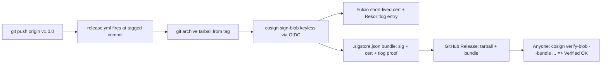

**Repo:** [LD-RW/GoSystems-High-Performance-HTTP-1.1-Server](https://github.com/LD-RW/GoSystems-High-Performance-HTTP-1.1-Server)
**Release:** [v1.0.0](https://github.com/LD-RW/GoSystems-High-Performance-HTTP-1.1-Server/releases/tag/v1.0.0) — tarball + `.sigstore.json` bundle

> [!abstract] Goal
> Tag a release of one of my repos, sign the artifact with cosign, and document the verify command in the README.

## Design decision: sign from CI, not from my laptop

Instead of signing locally (identity = my email via a browser OIDC dance), I signed from a **tag-triggered GitHub Actions workflow** (`release.yml`). The certificate identity then becomes the workflow ref itself — `.../.github/workflows/release.yml@refs/tags/v1.0.0` — issued by `https://token.actions.githubusercontent.com`. Why this is stronger:

- The artifact is a `git archive` tarball built **by CI from the tag**, then signed in the same run. A verifier gets cryptographic proof the tarball matches the tagged git state — directly addressing the xz lesson (CVE-2024-3094) that *release tarballs can diverge from git*.
- No key ever exists to leak: the runner's OIDC token is exchanged with Fulcio for a short-lived certificate, and the signature is logged to the public Rekor transparency log.
- Bonus: flips the OpenSSF Scorecard **Signed-Releases** check.

## What I did

1. Wrote `.github/workflows/release.yml` triggered on `push: tags: ['v*']` with `permissions: contents: write` (create the Release) and `id-token: write` (mint the OIDC token cosign needs). All Actions pinned by commit SHA, consistent with Task 1 (`actions/checkout`, `sigstore/cosign-installer`).
2. The workflow: builds `gosystems-v1.0.0.tar.gz` via `git archive` → signs it with `cosign sign-blob --yes --bundle gosystems-v1.0.0.tar.gz.sigstore.json` → creates the GitHub Release with both files attached using `gh release create`.
3. Documented the full `cosign verify-blob` command in a "Verifying releases" README section.
4. Committed with `--amend --no-edit` onto the earlier release commit and pushed with `git push --force-with-lease` (amend rewrites the SHA, so a plain push is rejected; `--force-with-lease` refuses to clobber if origin moved — safer habit than `--force`).
5. Tagged `v1.0.0` on the commit containing the workflow, pushed the tag, and the pipeline fired.
6. Verified locally on EndeavourOS (`sudo pacman -S cosign`) from a clean `/tmp` directory.



## Problems I faced

> [!warning] Problem 1 — the study material's verify command is cosign v2-era; my Arch cosign is v3
> The course showed `cosign sign-blob --output-signature ...` and a `verify-blob` with `--signature` (and no certificate input at all). On my machine (bleeding-edge Arch package = **cosign v3**), running the v2-style verify printed deprecation warnings: `--certificate`/`--signature` are deprecated in favor of `--bundle`, and will be removed in cosign v4.
>
> **Fix:** migrated to the v3 Sigstore bundle format — sign with `--bundle artifact.sigstore.json` (one file containing signature + certificate + Rekor inclusion proof) and verify with `--bundle` plus the identity/issuer flags. Cleaner for consumers too: one verification file instead of `.sig` + `.pem`.
>
> **Lesson:** I hit a live API migration in a security tool mid-task. The *concepts* (keyless identity, transparency log, tamper-evidence) were unchanged; only the packaging of verification material moved.

> [!warning] Problem 2 — release "not found": the tag never existed
> After the format fix, verification failed with `no such file or directory`, and diagnosis showed `gh release view v1.0.0` → **release not found**. Digging further: `git tag -l` and `git ls-remote --tags origin` were both **empty**. During cleanup of the first attempt (`gh release delete --cleanup-tag`), the tag was deleted and I never re-created it — and since the workflow trigger is `push: tags`, nothing ever ran. No tag → no trigger → no release.
>
> **Fix:** re-tag on `main`'s HEAD and push. Also internalized the related trap: tag-triggered workflows execute the workflow file *at the tagged commit*, so the tag must point at a commit that already contains `release.yml`.

> [!warning] Problem 3 — `gh run watch`: "found no in progress runs" (red herring)
> Right after pushing the tag, `gh run list` showed nothing and `gh run watch` found no runs. This was just indexing lag — GitHub takes a few seconds to register the run, and by the second check it had already **completed** (`gh run watch` only watches in-progress runs). The release existing with the CI-built bundle proved the run succeeded.

## Verification results

Real artifact:

```
❯ cosign verify-blob \
    --bundle gosystems-v1.0.0.tar.gz.sigstore.json \
    --certificate-identity 'https://github.com/LD-RW/GoSystems-High-Performance-HTTP-1.1-Server/.github/workflows/release.yml@refs/tags/v1.0.0' \
    --certificate-oidc-issuer 'https://token.actions.githubusercontent.com' \
    gosystems-v1.0.0.tar.gz
Verified OK
```

Tamper test — one appended byte (`echo "backdoor" >> tampered.tar.gz`):

```
Error: failed to verify signature: could not verify message:
invalid signature when validating ASN.1 encoded signature
```

Exactly the material's claim, demonstrated empirically: tampering at any step breaks verification.

## Final result

- ✅ Tag `v1.0.0` on `main`, pushed; `release.yml` fired at the tagged commit
- ✅ Release `v1.0.0` with two assets: `gosystems-v1.0.0.tar.gz` + `gosystems-v1.0.0.tar.gz.sigstore.json`
- ✅ Signature recorded in the public Rekor transparency log (tlog index in the workflow's sign-step log)
- ✅ Local verification on EndeavourOS: `Verified OK`, no deprecation warnings
- ✅ Tampered copy fails verification (exit code 1)
- ✅ README documents the exact `cosign verify-blob --bundle ...` command

> [!tip] Takeaways
> - Keyless ≠ trustless: trust moves from "who holds the key" to "which identity the OIDC issuer vouched for" — and for CI signing, that identity is a specific workflow file at a specific ref, which is far more auditable than a GPG key on someone's laptop.
> - The `.sigstore.json` bundle is self-contained verification material: signature, cert, and log proof travel together with the artifact.
> - `git push --force-with-lease` after `--amend` — never bare `--force`.
