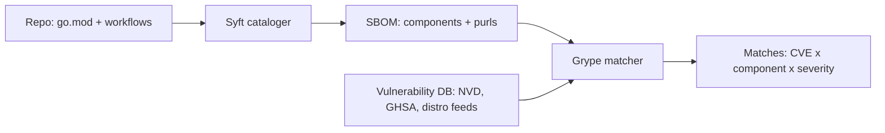

**Repo:** [LD-RW/GoSystems-High-Performance-HTTP-1.1-Server](https://github.com/LD-RW/GoSystems-High-Performance-HTTP-1.1-Server)
**Tools:** syft 1.44.0 (extra repo), grype 0.114.0, jq 1.8.2

> [!abstract] Goal
> Generate an SBOM of a repo (I've chosen my own repo btw) with Syft, actually *read* it, then scan it with Grype for known CVEs. 

## The mental model first

**Syft = inventory, Grype = matching.** Syft walks a source (directory, container image) looking for *package metadata* — `go.mod`, workflow files, apk databases — and emits an **SBOM**: a machine-readable list of every component, version, and origin. Grype takes that inventory and joins it against a vulnerability database aggregated from NVD, GitHub Security Advisories, and distro trackers. Separating the two is the point: the SBOM is a durable artifact — when tomorrow's CVE drops, you re-run Grype against *yesterday's* SBOM without touching the source. That's how the industry hunted Log4Shell.



## Command-by-command

### 1. `syft dir:. -o table`

**What it does:** scans the current directory (`dir:` source type) and prints a human-readable component table.
**Why:** first look at the inventory before committing anything to a file.

**Output, decoded:**

```
✔ Cataloged contents   cdb4ee2aea69...
  ├── ✔ Packages       [9 packages]
  ├── ✔ File digests   [3 files]
  ├── ✔ Executables    [0 executables]
```

- **`[9 packages]`** — the full dependency inventory: **5 Go modules** (my own module + 4 from `go.mod`/`go.sum`) and **3 distinct GitHub Actions** (with `actions/checkout` counted twice — see below).
- **`[3 files]`** — Syft also digested three metadata-bearing files (`go.mod`, `ci.yml`, `release.yml`); these become `file`-type entries in the SBOM.
- **`[0 executables]`** — nothing compiled in the tree; source-only scan.
- **The long hex string** (`cdb4ee2a...`) — a digest identifying this scan's source. Related to the `WARN no explicit name and version provided for directory source`: a directory (unlike an image `alpine:3.16`) has no natural name/version, so Syft derives an artifact ID from the path. Cosmetic; fixable with `--source-name`/`--source-version` if publishing the SBOM.
- **`actions/checkout v6.0.3 (+1 duplicate)`** — checkout appears in *both* `ci.yml` and `release.yml`; the table deduplicates for display but the SBOM keeps both occurrences.
- **`github.com/LD-RW/HTTPServer  UNKNOWN`** — my own module. A directory scan has no release/tag context, so my own code has no version. Everything *third-party* is precisely versioned — which is what vulnerability matching needs.

> [!tip] The quiet headline
> **My CI dependencies are in the SBOM.** `actions/checkout`, `actions/setup-go`, and `sigstore/cosign-installer` — the Task 1 attack surface — are inventoried right beside the Go modules. Build-time dependencies *are* dependencies.

### 2. `syft dir:. -o cyclonedx-json=sbom.cdx.json -o spdx-json=sbom.spdx.json`

**What it does:** same scan, emitted to files in both industry-standard formats in one pass — **CycloneDX** (security-tooling lineage; what Grype will eat) and **SPDX** (Linux Foundation / license-compliance lineage). Same inventory, different encodings.

### 3. `jq '.components | length' sbom.cdx.json` → `12`

**Why 12 when the table said 9 packages?** Arithmetic of the SBOM: 9 package components (including the checkout duplicate, which the table collapsed) **+ 3 `file` components** (the digested `go.mod`, `ci.yml`, `release.yml`) = 12. Lesson: an SBOM can inventory more than packages; always check the `type` field before counting "dependencies."

### 4. `jq -r '.components[] | [.type, .name, .version] | @tsv' ... | sort | column -t`

**What it does:** extracts type/name/version per component as tab-separated rows, aligned into columns — the SBOM as a readable ledger.

**Output, decoded:** 3 `file` rows (absolute paths of the digested files) + 9 `library` rows. The 4 third-party Go modules tell their own story: `testify` is my declared test dependency; `go-spew`, `go-difflib`, and `yaml.v3` are its **transitive** dependencies — I never chose them, but they're in my module graph, so they're in my inventory and my attack surface. That's the transitive-dependency lesson made concrete: 1 direct dependency brought 3 more.

### 5. `jq -r '.components[].purl' sbom.cdx.json`

**What it does:** extracts every component's **purl** (package URL) — the universal join key of the SBOM ecosystem, encoding *ecosystem + name + version* unambiguously:

- `pkg:golang/github.com/stretchr/testify@v1.11.1` — Go ecosystem
- `pkg:github/actions/checkout@v6.0.3` — GitHub Actions ecosystem

Grype matches these strings against vulnerability records; a purl is what makes an SBOM machine-actionable rather than a text list.

**The three `null`s at the end:** the `file` components. Files aren't packages, so they get no purl. Interpreting nulls in `jq` output by checking what produced them — instead of assuming breakage — saved a false debugging detour.

### 6. `grype sbom:./sbom.cdx.json`

**What it does:** loads the SBOM (`sbom:` source type — no re-scan of the repo), syncs the vulnerability DB (`✔ Vulnerability DB [updated]`), and joins inventory against known vulnerabilities.

**Output:**

```
✔ Scanned for vulnerabilities   [0 vulnerability matches]
  ├── by severity: 0 critical, 0 high, 0 medium, 0 low, 0 negligible
  └── by status:   0 fixed, 0 not-fixed, 0 ignored
No vulnerabilities found
```

## What the clean result actually means

The precise statement, worth writing carefully:

> **As of 2026-07-16, none of the 9 declared components of GoSystems (5 Go modules + 4 Action references) matches any publicly known vulnerability in Grype's DB.**

Every qualifier carries weight:

- **"As of 2026-07-16"** — the SBOM is frozen; the CVE world isn't. The same file can be dirty next month. That's *why* SBOMs are kept and re-scanned, not generated and discarded.
- **"declared components"** — Grype sees what Syft inventoried. My own code (`HTTPServer`) has no CVE entries because nobody has filed CVEs against my personal project — absence of evidence, not evidence of absence. Scanners find *known* vulnerabilities in *cataloged* components; they say nothing about novel bugs in first-party code.
- **"publicly known"** — zero-days are, by definition, not in the DB.

A clean scan is still a real security statement — small dependency surface (1 direct third-party module!), fully versioned, nothing flagged — but it's a statement about *known risk in declared inventory*, nothing more.
