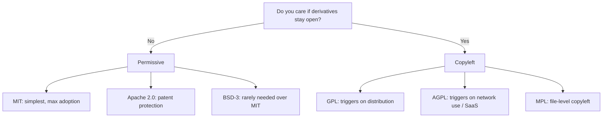

> [!important] Core idea
> Choosing an OSS license is legally the **most important decision** in a project. It determines who can use your code, on what terms, and whether they can keep modifications private.

## The Core Question

> Do I care whether someone can take my code, modify it, and never share those changes back?

- **No, I don't care** → Permissive license (MIT, Apache 2.0, BSD)
- **Yes, I want derivatives to stay open** → Copyleft license (GPL, AGPL, MPL)

## Two License Families

### Permissive
Few restrictions. Anyone can use, modify, and redistribute the code — including in closed-source or commercial products — as long as they keep the original copyright notice.

### Copyleft
Comes with a condition: if someone **distributes** a modified version (or, in some cases, **runs it as a service**), they must release their changes under the same license. This is the mechanism that keeps derivatives open.

## License Comparison

| License | Family | Trigger | Key Feature | Example Projects |
|---|---|---|---|---|
| MIT | Permissive | N/A | Simplest — do almost anything, keep copyright notice | Widely adopted libraries |
| Apache 2.0 | Permissive | N/A | Explicit patent grant + patent-retaliation clause | Enterprise / standards-track libs |
| BSD-3-Clause | Permissive | N/A | Like MIT + can't use author's name for promotion | Niche |
| GPL-3.0 | Copyleft | **Distribution** | Combined work must also be GPL if distributed | Linux, GCC |
| AGPL-3.0 | Copyleft | **Network use** | Closes the SaaS loophole — hosting counts as distribution | Grafana, Mastodon |
| MPL-2.0 | Copyleft (file-level) | **Distribution of modified file** | Only modified *files* must stay open; new files can be proprietary | Firefox |

## Decision Flow

## Dual Licensing

Some projects (MySQL, Qt) offer **two licenses at once**: a copyleft license (e.g. GPL) alongside a separate **commercial license** for companies that don't want copyleft obligations.

- More complex to administer
- Rarely the right starting point for a new project
- Worth recognizing as a monetization pattern layered on top of a license choice

## ⚠️ Common Misconceptions

> [!warning] Mistake 1 — "Open source" means "no rules"
> False. Even MIT has rules — you must keep the copyright notice and license text (e.g. in a `LICENSE` file or source comment block).

> [!danger] Mistake 2 — Public on GitHub = usable
> **The opposite and more dangerous mistake.** A public repo with **no LICENSE file grants zero rights**. By default, all rights are reserved — visibility does not imply permission. Nobody can legally use, copy, or modify the code, no matter how public it looks.

## Practical Checklist

- [ ] Always include a `LICENSE` file
- [ ] Always include the year and copyright holder name
- [ ] Decide: permissive vs copyleft, based on whether derivatives must stay open
- [ ] If copyleft, decide: distribution-trigger (GPL) vs network-use-trigger (AGPL) vs file-level (MPL)
- [ ] Consider [choosealicense.com](https://choosealicense.com) — GitHub's official guided tool (~60 seconds)

