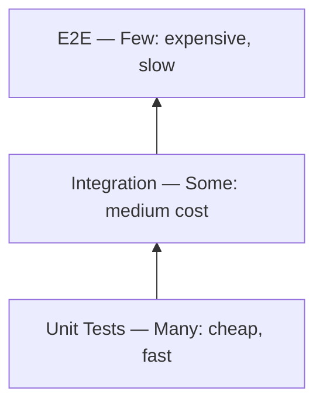

## Core Idea — Why Do We Have Different Types of Tests?

The most "realistic" way to test software is to simulate a real user — open a browser, click buttons, fill forms, and check results. So why not do *only* that?

Because **realism has a cost**:

- It's **slow** — launching a browser, waiting for pages to load, simulating clicks takes seconds to minutes per test.
- It's **fragile** — a tiny UI change (renaming a button) breaks the test even if the logic is fine.
- It's **hard to debug** — when it fails, you don't know *where* the problem is.
- It's **expensive to maintain** — every product change means rewriting tests.

On the other extreme, testing tiny isolated pieces of code with no real infrastructure is fast and precise, but doesn't tell you if the pieces work *together*.

So software engineers developed a **vocabulary of test types**, and frameworks for *how many of each type to write*. That's what the Test Pyramid and Testing Trophy are about.

---

## Key Concepts

### Unit Test

A test of the **smallest possible piece of code in isolation** — usually a single function or class.

```js
function add(a, b) { return a + b; }

expect(add(2, 3)).toBe(5);
```

| Property | Value |
|---|---|
| Speed | Milliseconds |
| Isolation | Total — no DB, no network, no filesystem |
| Catches | Logic bugs inside that one function |
| Misses | Whether that function works with everything else |

### Integration Test

Tests whether **multiple parts work correctly together**, often including real infrastructure like a real database.

Example: calling `saveUser(user)` actually stores the user in the DB and `getUser(id)` retrieves them correctly.

| Property | Value |
|---|---|
| Speed | Seconds |
| Isolation | Partial — real DB, but maybe not real external APIs |
| Catches | Bugs at boundaries — wrong SQL, misconfigured connections, mismatched data formats |
| Misses | Whether the full user-facing flow works end-to-end |

### End-to-End (E2E) Test

Simulates a **real user using the real application** from start to finish.

Example: Open browser → go to `/register` → fill in name/email/password → click "Sign Up" → verify landing on dashboard.

Tools: Playwright, Cypress.

| Property | Value |
|---|---|
| Speed | Minutes |
| Isolation | None — real browser, real backend, real database |
| Catches | Whether the full user experience works |
| Misses | *Where specifically* it broke when something fails |

### Static Analysis

Not a "test" — tools that **read your code without running it** and catch errors instantly.

- **TypeScript** — catches type mismatches at compile time (passing a `string` where a `number` is expected).
- **ESLint** — catches stylistic issues, potential bugs, and anti-patterns.

Eliminates entire categories of bugs before any code even executes.

---

## The Test Pyramid (Mike Cohn)



The geometry is **intentional** — it directly encodes cost and confidence:

| Test Type | Speed | Cost to Write | Cost to Run | Confidence |
|---|---|---|---|---|
| Unit | Milliseconds | Low | Very Low | Low–Medium |
| Integration | Seconds | Medium | Medium | High |
| E2E | Minutes | High | Very High | Very High |

The pyramid says: **build your test suite like a budget** — spend most of it where you get the best return.

### Why "Thousands of unit tests are cheaper than dozens of E2E tests"

This is a practical engineering economics statement. If your CI pipeline has:
- 1,000 unit tests → completes in ~30 seconds
- 50 E2E tests → takes ~20 minutes

Longer feedback loops = more bugs, slower development, more wasted time. E2E tests also **break more easily**: a designer renames a button → E2E test fails → engineer has to fix the test → wasted time. A unit test for the same underlying logic doesn't care about the button label.

---

## The Testing Trophy (Kent C. Dodds)

Kent C. Dodds noticed the classic pyramid didn't map well onto modern frontend development.

```
         /\
        /E2E\              ← Few
       /------\
      /Integration \       ← MOST of your tests here
     /--------------\
    /  Unit Tests    \     ← Some
   /------------------\
  [  Static Analysis  ]    ← The foundation (TypeScript / ESLint)
```

### Why the Trophy is Different

**1. In JavaScript, "unit" and "integration" are blurry.**

In Java or C++, module boundaries are clear. In JavaScript (especially React), a single component might render HTML, handle user events, manage state via hooks, and trigger API calls — all at once. Testing it in total isolation (mocking every hook, every child) produces tests so divorced from reality they barely tell you anything.

**2. Integration tests give the highest confidence per dollar in frontend.**

Libraries like **React Testing Library** let you test components the way users *use* them — render the real component tree, interact with real DOM events, check what the user would see. No real browser needed (uses a virtual DOM), so it runs fast while giving high confidence.

**3. Static analysis is foundational, not optional.**

TypeScript and ESLint catch bugs that would otherwise require tests to find. That's why static analysis is the *base* of the trophy.

---

## The Unifying Principle

> Write the cheapest test that meaningfully exercises the behavior.

Breaking this down word by word:

- **"Cheapest"** — not just cheap to write, but cheap to *run*, *maintain*, and *debug*. A test that runs in 1ms and never needs updating is cheaper than one that constantly breaks.
- **"Meaningfully"** — the test must actually catch bugs. A test that always passes regardless of correctness gives false confidence.
- **"Exercises the behavior"** — test what the code *does*, not *how* it does it. Testing implementation details means your tests break on every refactor. Testing behavior means tests survive refactoring.

### The Three Canonical Examples

**A pure function gets a unit test.**

A *pure function* has no side effects and always returns the same output for the same input. Nothing to mock, nothing external — a unit test is the cheapest meaningful test.

```js
function calculateDiscount(price, percentage) {
  return price * (1 - percentage / 100);
}
```

**A function that talks to a database gets an integration test against a real (test) database — not a mocked one.**

Why not mock? Because **the database is the behavior**. Mocking only tests that your code calls the mock correctly — not whether your SQL is right, your ORM mapping is correct, or null results are handled properly.

A real test database (e.g., PostgreSQL/SQLite spun up via Docker in CI) is slower than a mock, but it's the cheapest test that *meaningfully* catches the bugs you care about.

**A user-facing flow gets one happy-path E2E test.**

Notice: *one*. Not exhaustive coverage of every edge case. Just the core journey confirming "the system basically works end-to-end." Edge cases belong in unit and integration tests, where they're cheaper.

---

## Common Misunderstandings

**"More tests = better."**
No. 10,000 fragile, slow tests that test implementation details are worse than 1,000 fast, stable tests that test real behavior.

**"You should always mock external dependencies."**
Older orthodoxy. Modern wisdom: mock things that are truly external and uncontrollable (third-party payment APIs, email services). Use *real* test instances of things you own (your own database, your own internal services).

**"E2E tests are the most valuable because they're the most realistic."**
They're the most realistic, but "most valuable" means return on investment. E2E tests are expensive, slow, and fragile. If the same confidence can be achieved with an integration test, prefer that.

**"The pyramid is a strict rule."**
It's a *guideline* encoding cost tradeoffs. The Testing Trophy shows that context matters — a frontend React codebase may legitimately have more integration tests than unit tests.

---

## Summary in Plain Language

Different tests exist because there's a tradeoff between **realism** and **cost**. The more realistic a test, the slower, more expensive, and more fragile it is.

| Test Type | What it does | When to use it |
|---|---|---|
| Static Analysis | Catches type/lint errors without running code | Always, as a baseline |
| Unit Test | Tests one function in total isolation | Pure logic with no side effects |
| Integration Test | Tests multiple parts with real infrastructure | Anything touching a DB, API, or multiple modules |
| E2E Test | Simulates a real user in a real browser | The core happy-path user journey |

The **Test Pyramid** says: many unit tests, some integration, few E2E.
The **Testing Trophy** refines this for modern frontend: integration tests at the center, static analysis at the base.

The unifying principle behind both:

> Write the cheapest test that genuinely catches the bug you're worried about.
