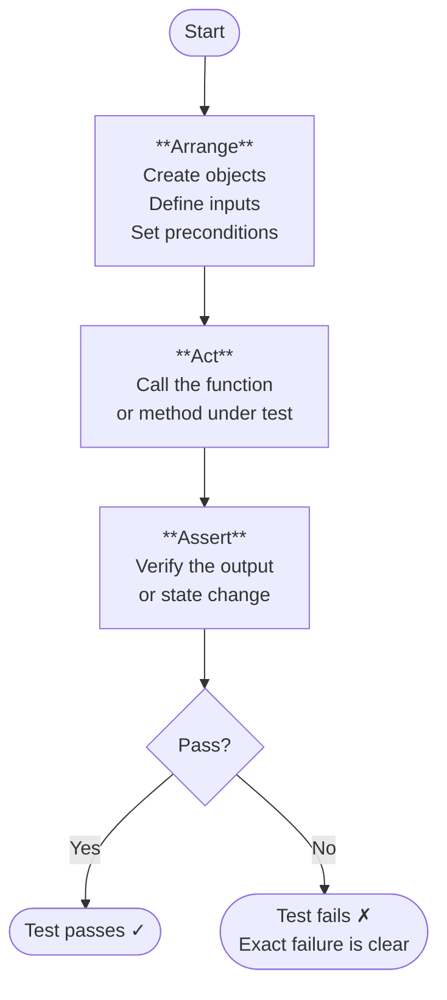
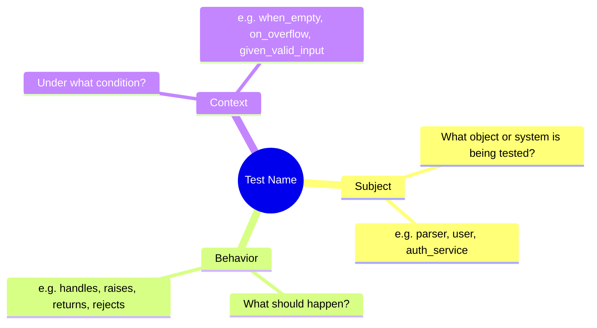
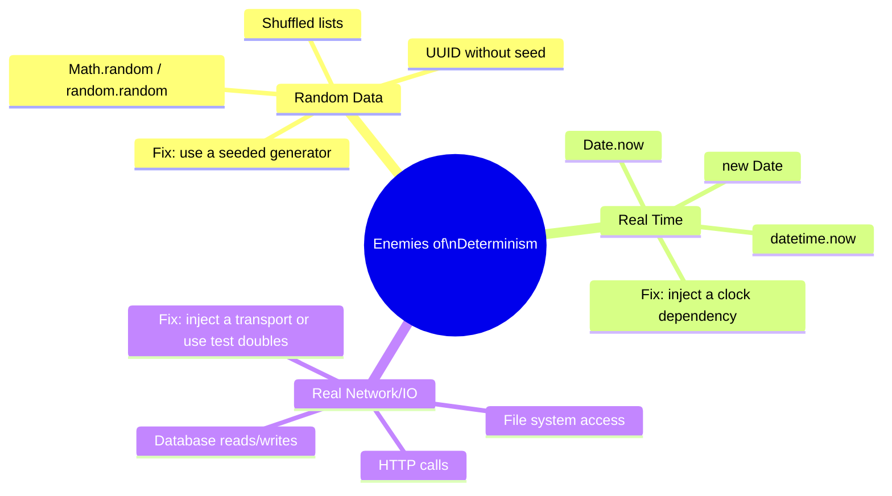
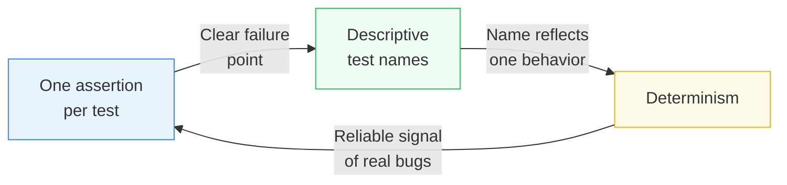

## Core Idea — What Makes a Unit Test "Good"?

Writing *a* unit test is easy. Writing a *good* one is a skill. A bad unit test gives you false confidence, breaks on every refactor, and makes debugging harder than if you had no test at all. A good unit test is a **precise, stable, readable specification of behavior** — it tells you exactly what the code is supposed to do, and screams loudly the moment it doesn't.

Three properties define a good unit test:
- **Structure** — it's organized in a predictable, readable way (Arrange / Act / Assert)
- **Focus** — it tests one thing and one thing only
- **Determinism** — it produces the same result every single time, on every machine, forever

---

## The Arrange / Act / Assert Pattern (AAA)

### What It Is

AAA is a **three-phase structure** for writing unit tests. Every test you write should map cleanly onto these three phases:

```
┌──────────────────────────────────────────┐
│  ARRANGE  →  set up the world            │
│  ACT      →  do the thing                │
│  ASSERT   →  check what happened         │
└──────────────────────────────────────────┘
```

### Why It Exists

Without a standard structure, tests become walls of code where setup, execution, and verification are tangled together. When a test fails, you spend time figuring out *what* it was actually checking before you can even start fixing it.

AAA solves this by making the test's intent immediately readable. A developer who has never seen this codebase can open any test and instantly understand: what was set up, what was triggered, and what was expected.

### The Example Broken Down

```python
def test_parser_handles_trailing_comma():
    # Arrange
    parser = JSON5Parser()
    input_text = '{"a": 1,}'

    # Act
    result = parser.parse(input_text)

    # Assert
    assert result == {"a": 1}
```

**Arrange phase:**
```python
parser = JSON5Parser()
input_text = '{"a": 1,}'
```
This is where you **build your world from scratch**. You create every object the test needs, define every input value, and set up any preconditions. The key word is *isolation* — you're constructing a controlled environment with no leftover state from previous tests.

Notice that `input_text` is defined here, not inline in the `parse()` call. This is intentional: it gives the input a **name** that communicates intent, and it keeps the Act phase clean.

**Act phase:**
```python
result = parser.parse(input_text)
```
This is the **single action** the test is exercising. One call. One line (usually). This is the behavior you're putting under the microscope. If your Act phase has multiple lines, that's a signal your test might be doing too much.

**Assert phase:**
```python
assert result == {"a": 1}
```
This is where you **verify the outcome**. You're not checking how the parser did its job internally — you're checking what it produced. The assertion should read almost like a sentence: "the result equals `{"a": 1}`."

### The Flow



---

## The Three Rules of a Good Unit Test

### Rule 1 — One Assertion (or One Logical Assertion) Per Test

**What it means:**

Each test should verify exactly one outcome. If something goes wrong, the test name alone should tell you *what broke*.

**Why multiple assertions are dangerous:**

```python
# BAD — multiple assertions
def test_parser():
    parser = JSON5Parser()
    result = parser.parse('{"a": 1,}')
    assert result == {"a": 1}          # If this fails...
    assert result is not None          # ...these never run
    assert len(result) == 1            # ...you don't know what else broke
```

When the first assertion fails, the test runner stops. You fix it, run again, and *now* the second one fails. You're fixing one problem at a time without a complete picture. This is called **assertion roulette** — you don't know which assertion actually caught the bug.

**The right approach:**

```python
# GOOD — separate tests, each checking one thing
def test_parser_returns_correct_value():
    result = JSON5Parser().parse('{"a": 1,}')
    assert result == {"a": 1}

def test_parser_result_is_not_none():
    result = JSON5Parser().parse('{"a": 1,}')
    assert result is not None
```

**What "one logical assertion" means:**

Sometimes you need to check multiple fields of a single object. That's still *one logical thing* — the state of the object:

```python
# This is acceptable — checking one object's logical state
def test_user_has_correct_profile():
    user = create_user(name="Alice", age=30)
    assert user.name == "Alice"
    assert user.age == 30
```

The rule isn't strictly "one `assert` keyword." It's "one concept being verified."

---

### Rule 2 — Names Describe Behavior, Not the Function

**What it means:**

The test name is documentation. It should answer the question: *"what specific behavior does this test verify?"*

**The pattern to follow:**

```
test_[subject]_[behavior]_[context]
```

| Bad Name | Good Name |
|---|---|
| `test_parse` | `test_parser_handles_trailing_comma` |
| `test_login` | `test_login_fails_when_password_is_wrong` |
| `test_add` | `test_add_raises_error_on_overflow` |
| `test_user` | `test_user_is_inactive_by_default` |

**Why this matters:**

When a test fails in CI at 2am, the failure report shows the test name. A good name tells you instantly what broke without opening the file:

```
FAILED: test_parser_handles_trailing_comma
```
→ *"The parser is failing on trailing commas."*

```
FAILED: test_parse
```
→ *"Something about parsing is broken."* (Useless)

**Mind map of naming elements:**



---

### Rule 3 — Tests Must Be Deterministic

**What it means:**

A deterministic test produces the **exact same result every single time** — on your machine, on your colleague's machine, in CI, at midnight, at noon, this year, and five years from now. If a test passes sometimes and fails other times (a "flaky test"), it is worse than useless. It trains developers to ignore failures.

**The three enemies of determinism:**



**The problem with random data:**

```python
# BAD — this will fail ~50% of the time for inputs < 0
def test_square_root():
    n = random.randint(-100, 100)  # might be negative!
    result = math.sqrt(n)
    assert result >= 0
```

The test isn't testing your code — it's gambling. The fix is either a fixed value or a **seeded generator** (same seed = same sequence every time):

```python
# GOOD — seeded, so always produces the same "random" numbers
def test_square_root():
    rng = random.Random(42)
    n = rng.randint(0, 100)
    result = math.sqrt(n)
    assert result >= 0
```

**The problem with real time:**

```python
# BAD — will fail on New Year's Eve, or when a second boundary is crossed mid-test
def test_session_expiry():
    session = Session()
    session.created_at = datetime.now()
    assert not session.is_expired()
```

The fix is **dependency injection** — pass the clock in rather than calling it directly:

```python
# GOOD — the clock is injected, so you control "now" completely
def test_session_expiry():
    fake_now = datetime(2024, 6, 15, 12, 0, 0)
    session = Session(clock=lambda: fake_now)
    assert not session.is_expired()
```

**The problem with real networks:**

```python
# BAD — fails if the network is down, the API rate-limits you, or the server is slow
def test_fetch_user():
    user = fetch_from_api("https://api.example.com/users/1")
    assert user["name"] == "Alice"
```

The fix is **injecting a transport** — a fake HTTP layer that returns controlled, predictable responses:

```python
# GOOD — no real network, fully predictable
def test_fetch_user():
    fake_transport = FakeHTTP(response={"name": "Alice"})
    user = fetch_from_api("users/1", transport=fake_transport)
    assert user["name"] == "Alice"
```

---

## How the Three Rules Connect

The three rules aren't independent — they reinforce each other:



- **One assertion** makes the failure obvious → you can write a **descriptive name** for exactly what broke
- **A descriptive name** forces you to think about one specific behavior → you're less likely to mix in non-deterministic concerns
- **Determinism** ensures the assertion fires reliably → one failing assertion means one real bug, not a timing coincidence

---

## Common Misunderstandings

**"One assertion means one `assert` keyword."**
No. One *logical concept* being verified. Checking `user.name` and `user.age` on the same object is still one logical assertion — the correctness of the user object.

**"Descriptive names make tests verbose and hard to scan."**
The opposite is true. Long test names make the test output readable as a list of specifications. Failing tests tell you exactly what broke without opening a single file.

**"Mocking everything makes tests more isolated."**
Mocking indiscriminately makes tests test the mock, not your code. Only mock what makes the test non-deterministic (time, network, randomness). Use real objects everywhere else.

**"Seeding a random generator isn't really random."**
Correct — and that's the point. You don't want real randomness in tests. If you want to test many inputs, use **property-based testing** (e.g. `hypothesis` in Python) which generates cases systematically and reproducibly.

---

## Summary in Plain Language

A good unit test has three phases: **Arrange** (set up), **Act** (trigger), **Assert** (verify). This structure makes every test instantly readable.

Three rules keep tests high-quality:

| Rule | Core idea | Why it matters |
|---|---|---|
| One assertion per test | Each test checks one thing | When it fails, you know exactly what broke |
| Names describe behavior | Name = specification | Failure reports are self-explanatory |
| Tests are deterministic | Same result every time | Flaky tests destroy trust in the entire test suite |

The enemies of determinism are **random data**, **real time**, and **real networks**. The solution in all three cases is the same: **inject the dependency** so the test controls it completely.
