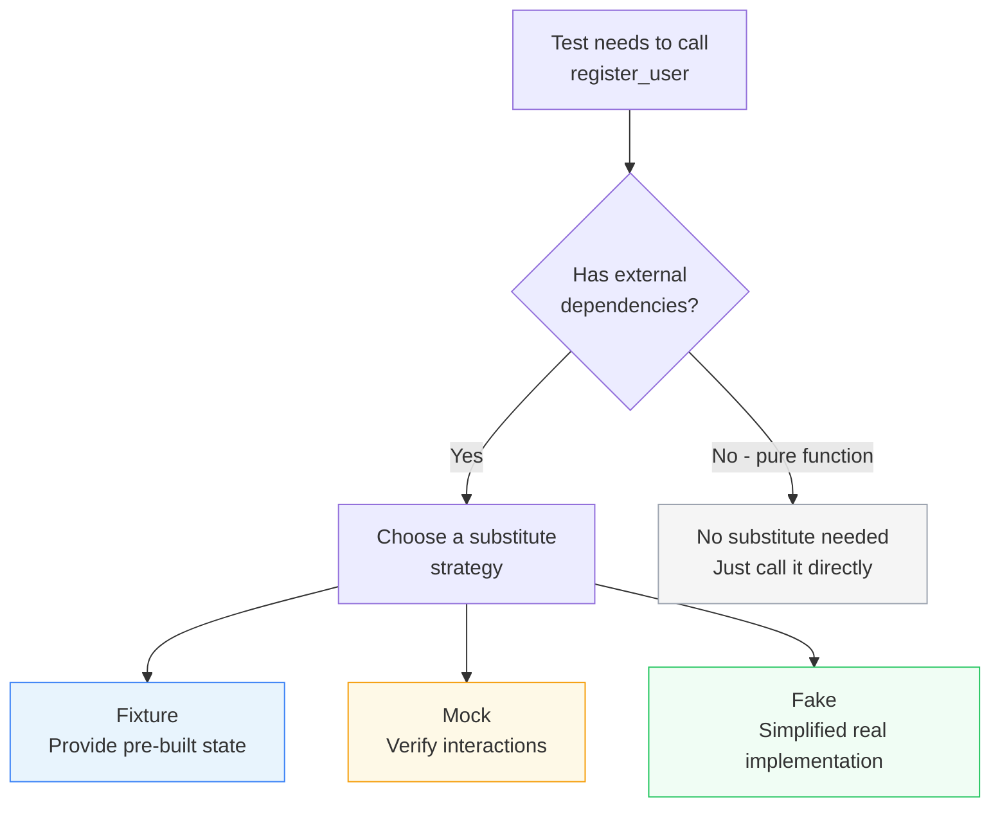
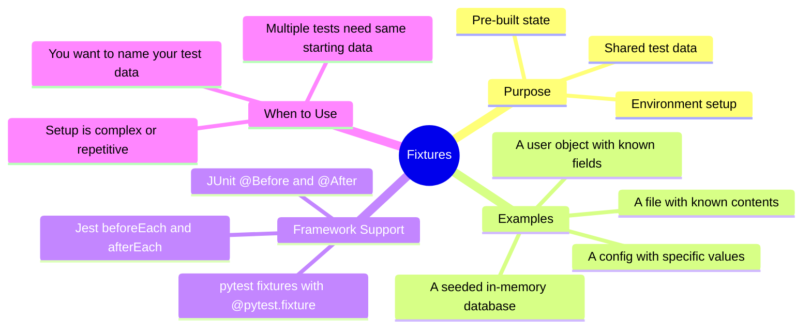
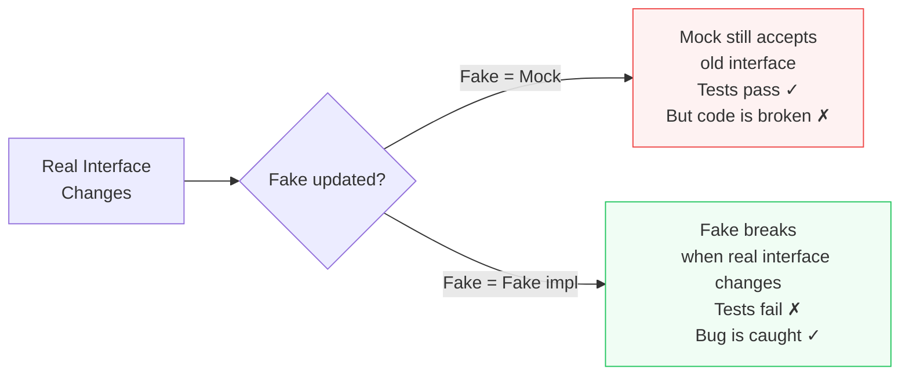
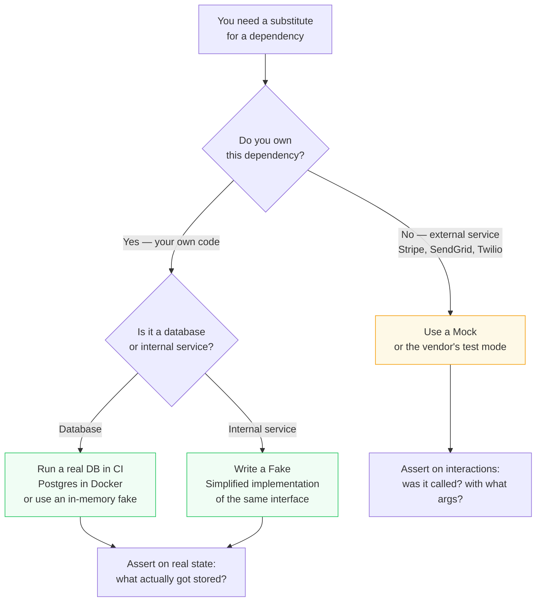
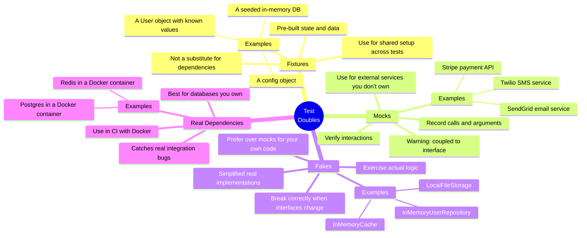

## Core Idea — Why Do We Need Any of This?

Unit and integration tests don't run in a vacuum. Real code has **dependencies** — it talks to databases, sends emails, calls payment APIs, reads files, checks the current time. When you test that code, you have a choice:

- Use the **real** dependency (real database, real Stripe API)
- Use a **substitute** — something that stands in for the real thing

Substitutes exist on a spectrum from "completely fake" to "almost real." Understanding that spectrum — and knowing when to use each point on it — is what this topic is about.

The three tools are: **Fixtures**, **Mocks**, and **Fakes**. They solve different problems and have different tradeoffs.

---

## The Dependency Problem

Before diving into solutions, let's feel the problem clearly.

Suppose you have this function:

```python
def register_user(email, password, db, email_sender):
    user = User(email=email, password=hash(password))
    db.save(user)
    email_sender.send_welcome_email(user)
    return user
```

This function has two external dependencies: a **database** and an **email sender**. To test it, you need both. But:

- A real database requires setup, teardown, and might be slow
- A real email sender would actually send emails to real people during tests

You need substitutes. But what kind?



---

## Fixtures — Pre-Built State

### What They Are

A fixture is **pre-built state that your test needs to start running**. It's not a substitute for a dependency — it's the *data* or *environment* you set up before the actual test logic begins.

Think of it like mise en place in cooking — before you start cooking, you chop the vegetables, measure the spices, and lay everything out. Fixtures are the mise en place of testing.

In **pytest** (Python):

```python
import pytest

@pytest.fixture
def sample_user():
    return User(id=1, email="alice@example.com", name="Alice")

def test_user_greeting(sample_user):
    assert greet(sample_user) == "Hello, Alice!"
```

The `sample_user` fixture is automatically injected into any test that declares it as a parameter. pytest finds it, builds it, and hands it over.

In **Jest** (JavaScript):

```javascript
let db;

beforeEach(() => {
    db = createTestDatabase();      // runs before every test
    db.seed([{ id: 1, name: "Alice" }]);
});

afterEach(() => {
    db.clear();                     // cleans up after every test
});

test("finds user by id", () => {
    const user = db.findById(1);
    expect(user.name).toBe("Alice");
});
```

### What Fixtures Are NOT

Fixtures are **not** substitutes for dependencies. They're the *inputs* and *initial conditions* your test operates on. A fixture might be:

- A pre-built user object
- A pre-seeded database
- A configuration object
- A file with known contents

### When to Use Fixtures

- When multiple tests need the **same starting state**
- When building that state inline would clutter every test
- When you want to **name** a piece of test data to communicate its purpose



---

## Mocks — Verifying Interactions

### What They Are

A mock is a **fake object that records how it was used**, so you can assert that your code interacted with it in a specific way.

The key word is *interactions*. Mocks don't care about the *result* of a call — they care about *whether the call happened*, *how many times*, and *with what arguments*.

```python
from unittest.mock import MagicMock

def test_register_user_sends_welcome_email():
    # Arrange
    db = MagicMock()
    email_sender = MagicMock()

    # Act
    register_user("alice@example.com", "password123", db, email_sender)

    # Assert — verify the interaction
    email_sender.send_welcome_email.assert_called_once()
    db.save.assert_called_once()
```

The mock doesn't actually save anything to a database or send any email. It just silently records that `save()` and `send_welcome_email()` were called, and lets you assert on that later.

### The Hidden Cost of Mocks — Coupling

Mocks are **coupled to the interface they're mocking**. If the real interface changes, every mock that mimics it silently breaks — and not always in obvious ways.

Example: You mock an email sender with this interface:

```python
email_sender.send_welcome_email(user)
```

Six months later, the real `EmailSender` class is refactored:

```python
# New interface — now takes email and name separately
email_sender.send_welcome(to_address=user.email, name=user.name)
```

Your mock still happily accepts `send_welcome_email(user)` — it doesn't complain. Your tests still pass. But your real code is broken.

This is the **false confidence problem** with mocks: they can give you green tests while your actual integration is silently broken.



### When Mocks Make Sense

Mocks are the right tool when you need to verify **behavior** (not just outcomes), and when the dependency is something you **don't own** — an external service whose interface is stable and not under your control.

---

## Fakes — Simplified but Real

### What They Are

A fake is a **simplified but working implementation** of a dependency. It implements the same interface as the real thing, but does the work in a simpler, faster, in-memory way — with no network, no disk, no external service.

The classic example is an **in-memory database**:

```python
class InMemoryUserRepository:
    """A fake database — same interface as the real one, but stores data in a dict."""

    def __init__(self):
        self._store = {}

    def save(self, user):
        self._store[user.id] = user   # real save logic, just in memory

    def find_by_id(self, user_id):
        return self._store.get(user_id)  # real find logic, just in memory

    def delete(self, user_id):
        self._store.pop(user_id, None)
```

Now your test uses this instead of a mock:

```python
def test_register_user_stores_user_in_db():
    # Arrange
    db = InMemoryUserRepository()    # fake — not a mock
    email_sender = MagicMock()       # mock — we don't own the email service

    # Act
    register_user("alice@example.com", "password123", db, email_sender)

    # Assert — verify real state, not just interactions
    saved_user = db.find_by_id(1)
    assert saved_user.email == "alice@example.com"
```

Notice the difference: with a mock, you'd assert `db.save.assert_called_once()` — verifying that save was *called*. With a fake, you assert `saved_user.email == "alice@example.com"` — verifying that the data was *actually stored and retrievable*. That's a much stronger guarantee.

### Why Fakes Are Usually Better Than Mocks

| Property | Mock | Fake |
|---|---|---|
| Exercises real logic | No — records calls only | Yes — runs simplified real code |
| Breaks when interface changes | No — silently accepts old calls | Yes — compilation/runtime error |
| Tests state or behavior | Behavior only | Both state and behavior |
| Setup complexity | Low (auto-generated) | Higher (must implement interface) |
| Confidence level | Lower | Higher |

The tradeoff is real: fakes take more work to write. But they give you *much* more confidence that your code actually works.

---

## The Decision Heuristic — Fakes > Mocks

The guiding principle is simple:

> **Prefer fakes over mocks. Mock only external services you don't own.**

Here's how to apply it:



### "Don't Mock Your Own Database" — Explained

This is one of the most important pieces of advice in modern testing, and it runs counter to older testing orthodoxy.

The old approach: mock the database layer so tests run fast and in isolation.

The problem: your mock's interface is your *assumption* of how the database behaves — not how it actually behaves. Real databases have:

- Unique constraint violations
- Foreign key errors
- NULL handling quirks
- Transaction rollback behavior
- Specific error types on failure

None of this is exercised when you mock. You can have 100% test coverage and still have a database bug in production that your tests never caught.

The modern approach: **run a real database in CI**. With Docker, this is genuinely easy:

```yaml
# GitHub Actions — one job, real Postgres, zero ceremony
services:
  postgres:
    image: postgres:16
    env:
      POSTGRES_PASSWORD: test
      POSTGRES_DB: testdb
    ports:
      - 5432:5432
```

That's it. Your tests run against a real Postgres instance. Every query, every constraint, every transaction is exercised for real. The database spins up in seconds and tears down automatically.

### When to Mock External Services

If you're calling **Stripe** for payments, **SendGrid** for email, or **Twilio** for SMS, you should mock those — or use the vendor's sandbox/test mode. You can't run a real Stripe environment in CI, you don't want to actually charge cards during tests, and you don't own that interface.

The right mock pattern for external services:

```python
def test_payment_calls_stripe_with_correct_amount():
    # Arrange
    stripe = MagicMock()

    # Act
    process_payment(amount=4999, currency="usd", stripe=stripe)

    # Assert — verify the right call was made
    stripe.charge.assert_called_once_with(amount=4999, currency="usd")
```

---

## Putting It All Together — A Decision Map



---

## Common Misunderstandings

**"Mocks are bad — never use them."**
No. Mocks are the *right* tool for external services you don't own. The mistake is using mocks for *everything*, including your own database and internal services.

**"Fakes are just slower mocks."**
Fakes and mocks serve different purposes. A mock *records* calls. A fake *executes* logic. An in-memory database actually stores and retrieves data — a mock database just notes that `save()` was called.

**"Running a real database in CI is expensive and slow."**
A Postgres container starts in under 5 seconds and costs nothing on most CI platforms. The cost of *not* testing against a real database is paying for bugs in production.

**"If I use a fake, I have to maintain two implementations."**
Yes — and that's worth it. A fake is a contract: it forces both the fake and the real implementation to honour the same interface. When the interface changes, the fake breaks loudly during tests, not silently in production.

---

## Summary in Plain Language

| Tool | What it is | Best used for |
|---|---|---|
| **Fixture** | Pre-built state/data your test starts with | Shared setup, named test data |
| **Mock** | A fake that records interactions | External services you don't control |
| **Fake** | A simplified but real implementation | Your own databases, caches, internal services |
| **Real dependency** | The actual thing, in a container | Databases in CI — always prefer this |

The **hierarchy of preference** is:

```
Real dependency in CI  >  Fake  >  Mock
```

Use a mock only when you have no better option — specifically, when the dependency is an external service you don't own. For everything else, either run the real thing or write a fake that exercises actual logic.
