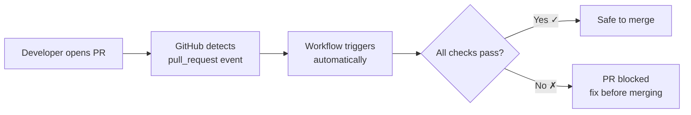
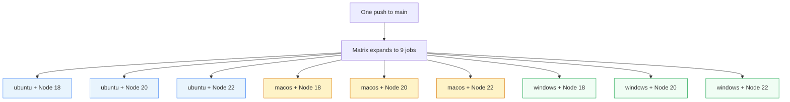
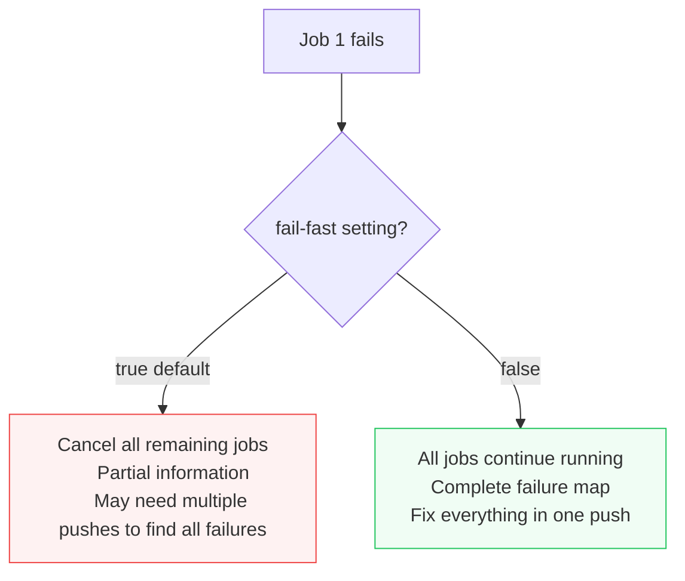
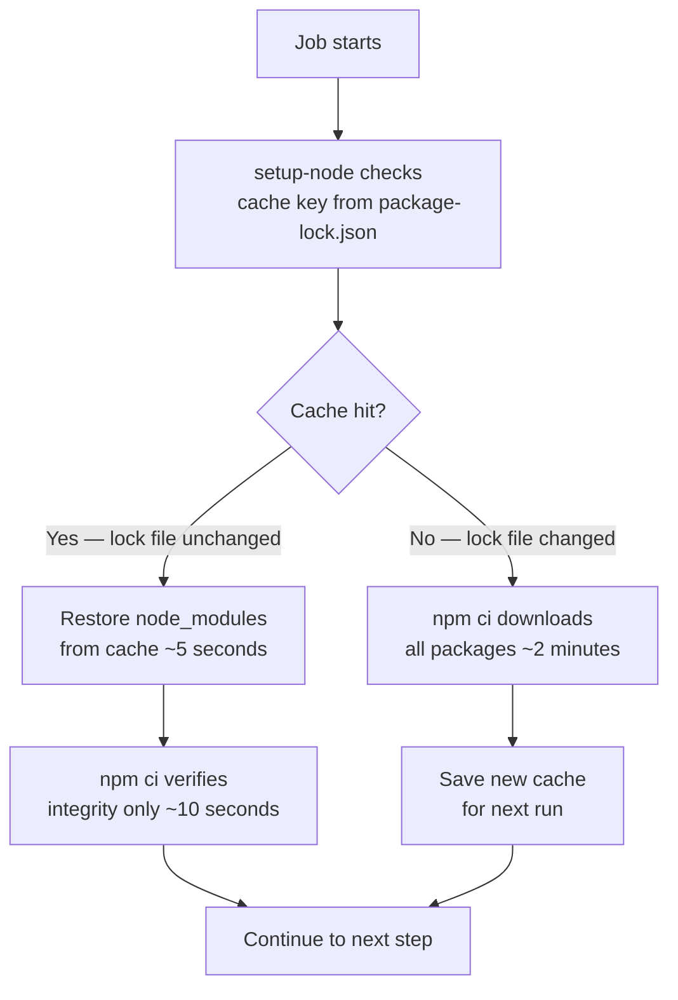
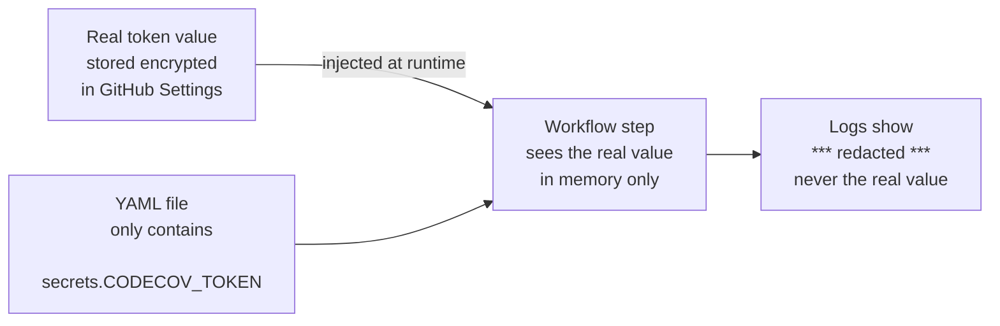
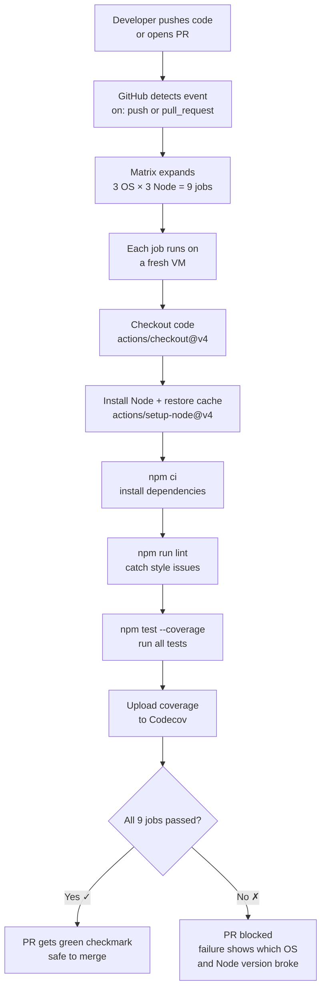

## Core Idea — What Is CI and Why Does It Exist?

**Continuous Integration (CI)** is the practice of automatically running your tests, linters, and checks every time someone pushes code or opens a pull request. The word "continuous" means you're not waiting until the end of a sprint or a release cycle — you're integrating and verifying code *continuously*, every single commit.

Without CI, the typical failure mode looks like this:

> Developer A works on a feature for 3 days. Developer B works on a different feature for 3 days. They both merge to `main` on Friday afternoon. The combination breaks everything. Nobody knows whose code caused it. It's 5pm on Friday.

CI catches this the moment the conflict is introduced — not days later.

The file in this topic is a **GitHub Actions workflow** — a YAML file that tells GitHub: *"whenever code is pushed, run these steps automatically on a fresh machine."*

---

## What Is a GitHub Actions Workflow?

GitHub Actions is GitHub's built-in CI/CD system. A **workflow** is defined as a YAML file inside `.github/workflows/`. GitHub reads this file and executes it automatically based on triggers you define.

The structure of every workflow follows this hierarchy:

```mermaid
flowchart TD
    A[Workflow
    .github/workflows/ci.yml] --> B[Trigger
    on: push / pull_request]
    B --> C[Job
    A unit of work on one machine]
    C --> D[Matrix
    Run same job on multiple configs]
    D --> E[Steps
    Individual commands or actions]
    E --> F[Action
    Reusable step from the marketplace]
    E --> G[Run
    Raw shell command]
```



---

## The Full File — Annotated

```yaml
name: CI

on:
  push:
    branches: [main]
  pull_request:

jobs:
  test:
    runs-on: ${{ matrix.os }}
    strategy:
      fail-fast: false
      matrix:
        os: [ubuntu-latest, macos-latest, windows-latest]
        node: [18, 20, 22]
    steps:
      - uses: actions/checkout@v4
      - uses: actions/setup-node@v4
        with:
          node-version: ${{ matrix.node }}
          cache: npm
      - run: npm ci
      - run: npm run lint
      - run: npm test -- --coverage
      - uses: codecov/codecov-action@v4
        with:
          token: ${{ secrets.CODECOV_TOKEN }}
```

Let's now go through every concept in this file from first principles.

---

## Concept 1 — Triggers (`on:`)

```yaml
on:
  push:
    branches: [main]
  pull_request:
```

This tells GitHub *when* to run the workflow. There are two triggers here:

- **`push` to `main`** — runs whenever commits are pushed directly to the `main` branch (e.g. a merge)
- **`pull_request`** — runs on every PR opened or updated, regardless of target branch

The most important trigger is `pull_request`. This is what gives you the superpower of CI: **you see whether the tests pass *before* you merge**, not after.



---

## Concept 2 — The Matrix Strategy

This is the most powerful feature in this workflow.

```yaml
strategy:
  fail-fast: false
  matrix:
    os: [ubuntu-latest, macos-latest, windows-latest]
    node: [18, 20, 22]
```

### What a Matrix Does

A matrix takes a set of variables and runs the **same job once for every combination**. Here, 3 operating systems × 3 Node versions = **9 parallel jobs**, all triggered by a single push.



### Why This Catches "Works on My Machine"

Path separators, line endings, filesystem behavior, and available system tools differ between OSes. A test that passes on your Mac can fail on Windows because:

- Windows uses `\` as a path separator, not `/`
- Windows line endings are `\r\n`, not `\n`
- Case-insensitive filesystem on Windows and Mac, case-sensitive on Linux

Without a matrix, you'd only discover this after deploying to a Linux server. With a matrix, you catch it in the PR.

Node version coverage similarly catches APIs that were added in Node 20 but don't exist in Node 18 — guaranteeing your code works for users on older runtimes.

### `fail-fast: false` — Getting Full Signal

```yaml
fail-fast: true   # DEFAULT — if one cell fails, cancel all others immediately
fail-fast: false  # BETTER  — let all cells run even if some fail
```

The default behavior (`fail-fast: true`) cancels all running jobs the moment one fails. This sounds efficient, but it destroys information:

> Suppose Node 18 on Ubuntu fails, but the Windows jobs haven't started yet. With `fail-fast: true`, those get cancelled. You fix the Node 18 issue, push again — and now discover Windows was *also* broken. Two pushes, two CI cycles, wasted time.

With `fail-fast: false`, all 9 jobs run to completion. You get a complete picture of *everything* that's broken in one pass.



---

## Concept 3 — The Steps

Steps run sequentially inside each matrix cell. If any step fails, the remaining steps in that cell are skipped and the job is marked as failed.

### Step 1 — Checkout (`actions/checkout@v4`)

```yaml
- uses: actions/checkout@v4
```

When GitHub spins up a fresh virtual machine to run your job, **your code is not on it**. This step clones your repository onto the machine. It's always the first step — nothing else can run without your code being present.

### Step 2 — Setup Node (`actions/setup-node@v4`)

```yaml
- uses: actions/setup-node@v4
  with:
    node-version: ${{ matrix.node }}
    cache: npm
```

This installs Node.js at the version specified by the current matrix cell (`18`, `20`, or `22`). The `${{ matrix.node }}` syntax is how you reference matrix variables in steps.

**`cache: npm`** is a critical optimization (explained in detail below).

### Step 3 — Install Dependencies (`npm ci`)

```yaml
- run: npm ci
```

`npm ci` (short for "clean install") installs exact dependency versions from `package-lock.json`. It's different from `npm install` in a few important ways:

| | `npm install` | `npm ci` |
|---|---|---|
| Reads from | `package.json` (ranges) | `package-lock.json` (exact versions) |
| Modifies lock file | Yes | Never |
| Speed | Slower | Faster |
| Reproducibility | Lower | Higher |

In CI, you always want `npm ci` — exact, reproducible, and faster.

### Step 4 — Lint (`npm run lint`)

```yaml
- run: npm run lint
```

Runs your linter (ESLint, Prettier checks, etc.) before the tests. Linting is caught here before any test runs — faster feedback on style and static issues.

### Step 5 — Test with Coverage (`npm test -- --coverage`)

```yaml
- run: npm test -- --coverage
```

Runs the full test suite and generates a **coverage report** — a measure of what percentage of your code is exercised by tests. The `--` passes the `--coverage` flag through to the underlying test runner (Jest, Vitest, etc.).

### Step 6 — Upload Coverage (`codecov/codecov-action@v4`)

```yaml
- uses: codecov/codecov-action@v4
  with:
    token: ${{ secrets.CODECOV_TOKEN }}
```

Sends the coverage report to [Codecov](https://codecov.io), a service that tracks coverage over time and comments on PRs showing whether coverage went up or down. The token is pulled from GitHub Secrets — never hardcoded.

---

## Concept 4 — Caching (`cache: npm`)

```yaml
cache: npm
```

This single line can cut your CI time from **3 minutes to 30 seconds**.

### Why Without Cache Is Slow

Every matrix cell starts as a completely fresh virtual machine. Without caching, every cell runs `npm ci` which downloads all packages from the internet — from scratch, every time. For a project with 500 dependencies, that's the same 500 packages downloaded 9 times per push.

### How the Cache Works

`actions/setup-node` with `cache: npm` stores the `node_modules` contents between runs using GitHub's cache storage. The cache key is derived from `package-lock.json`. If the lock file hasn't changed, the cache is hit and `npm ci` uses local packages instead of downloading.



The cache is **invalidated automatically** when `package-lock.json` changes — meaning you always get fresh packages when dependencies are updated, but cached packages on every other push.

---

## Concept 5 — Secrets (`secrets.CODECOV_TOKEN`)

```yaml
token: ${{ secrets.CODECOV_TOKEN }}
```

### What Secrets Are

Secrets are encrypted values stored in GitHub's repository settings (Settings → Secrets and variables → Actions). They're injected into workflow runs as environment variables, but **never printed in logs**, even if you accidentally `echo` them.

### The Cardinal Rule

> **Never put secret values in the YAML file. Never commit them to the repository.**

If you write `token: abc123xyz` directly in the YAML, that token is now visible to everyone who can read the repository — including anyone who forks it, and anyone who searches GitHub's public code index.

The correct pattern is always:
1. Go to repo Settings → Secrets
2. Add the secret with a name (`CODECOV_TOKEN`)
3. Reference it in YAML as `${{ secrets.CODECOV_TOKEN }}`

GitHub injects the value at runtime. The actual value never appears in any log or file.



---

## Concept 6 — Pinned Action Versions (`@v4`)

```yaml
- uses: actions/checkout@v4
- uses: actions/setup-node@v4
- uses: codecov/codecov-action@v4
```

### What Pinning Means

Every action reference has a version tag after `@`. Using `@v4` means "use the version tagged v4 of this action." The alternative — `@main` or `@latest` — means "use whatever is at the tip of the main branch right now."

### Why `@main` Is Dangerous — Supply Chain Attacks

An action is code that runs on your CI machine with access to your secrets and repository. If you use `@main` and the action's maintainer (or an attacker who compromises their account) pushes malicious code to `main`, your next CI run executes that malicious code — automatically, with your secrets in scope.

This is called a **supply chain attack** — attacking you by compromising something you depend on.

With `@v4`, you're pinned to a specific, audited release. Even if the maintainer's account is compromised tomorrow and malicious code is pushed to `main`, your workflow continues using the vetted `v4` release.

The most secure form is pinning to a full commit SHA:

```yaml
# Maximum security — pinned to exact commit, immutable
- uses: actions/checkout@11bd71901bbe5b1630ceea73d27597364c9af683
```

A version tag like `@v4` can be moved to point at a different commit. A SHA cannot.

---

## The Full Pipeline — How It All Fits Together



---

## Common Misunderstandings

**"CI is just running tests automatically — I can do that manually."**
The key isn't automation for its own sake — it's that CI runs on a *clean machine* with *exact dependency versions* against *the merged result* of your branch and main. Your local machine has accumulated state, different globals, and your unmerged code. CI is the neutral ground.

**"`fail-fast: true` saves money because jobs are cancelled early."**
It saves compute minutes at the cost of information. You end up pushing multiple times to discover each new failure. The extra pushes cost more total time than letting all jobs finish once.

**"I can put the secret in the YAML and just not tell anyone."**
The YAML is committed to the repository. Anyone with read access — including people who fork the repo — can read it. GitHub even indexes public repository code. There is no "just don't tell anyone" with hardcoded secrets.

**"Pinning to `@v4` is the same as pinning to a commit SHA."**
No. A tag like `v4` is a mutable pointer — it can be updated to point at any commit. A SHA is immutable. For maximum security, pin to a full SHA. For practical security, `@v4` is still far better than `@main`.

---

## Summary in Plain Language

This workflow does the following automatically on every push and PR:

| What | Why |
|---|---|
| Runs on 3 OSes × 3 Node versions | Catches environment-specific bugs before they reach production |
| `fail-fast: false` | Gets the full failure picture in one CI run |
| Caches `node_modules` | Cuts install time from minutes to seconds |
| Lints before testing | Fails fast on style issues without wasting time on the full test suite |
| Runs tests with coverage | Verifies behavior and tracks what code is exercised |
| Uses secrets properly | Keeps tokens out of the codebase and out of logs |
| Pins action versions | Protects against supply chain attacks |

The deeper principle: **CI is your first production environment**. It's a clean, controlled machine where your code has to prove it works before it earns the right to be merged.
