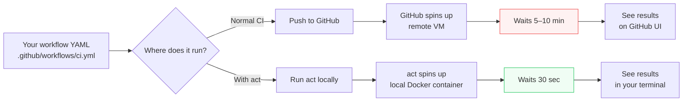
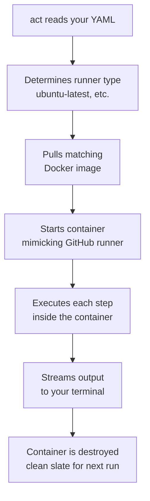
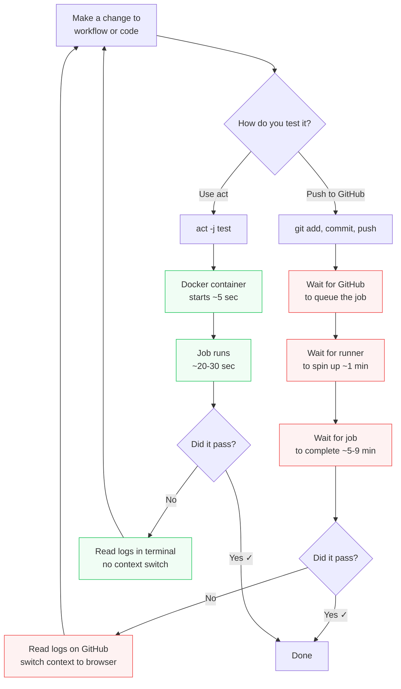
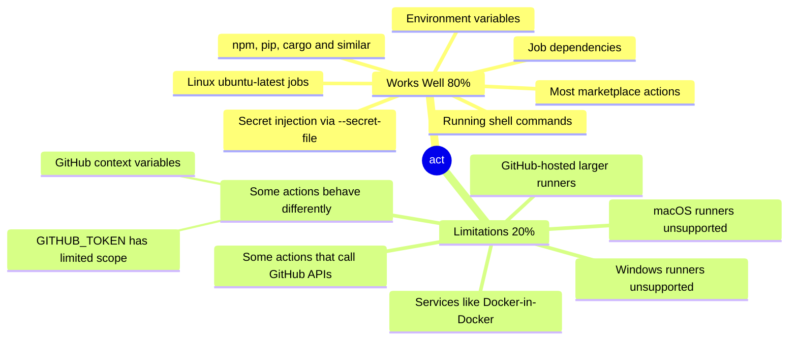
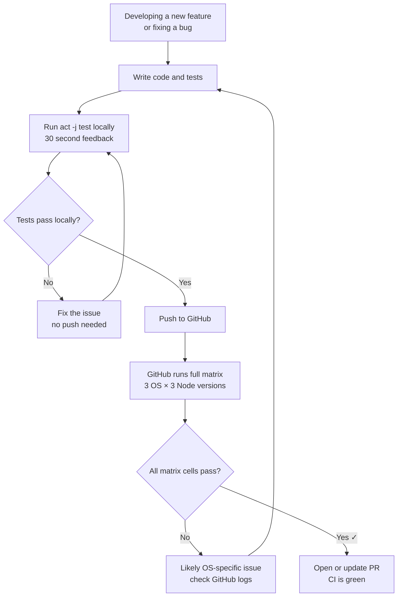

## Core Idea — The Pain of Pushing to Debug CI

There's a specific kind of frustration every developer knows: you write a workflow file, push it, wait 3–10 minutes for CI to run, see it fail on a YAML indentation error, fix it, push again, wait again, fail again on a missing secret, fix it, push again...

This is called **push-to-debug CI**, and it's one of the most wasteful feedback loops in modern software development. You're using a remote machine as your debugger, paying for it with time (and sometimes money), and getting results 10 minutes after you made the change.

`act` breaks this loop entirely. It runs your GitHub Actions workflows **locally inside Docker containers**, giving you the same CI feedback in seconds instead of minutes — without touching GitHub at all.

---

## What Is `act`?

`act` is an open-source CLI tool that reads your `.github/workflows/` YAML files and executes them locally by spinning up Docker containers that mimic GitHub's runner environments.

The key insight is that GitHub Actions runners are just Linux containers with specific tools pre-installed. `act` replicates those containers on your machine, runs your steps inside them, and streams the output to your terminal — exactly as you'd see it in GitHub's UI.



---

## Background You Need — What Is Docker?

`act` relies on Docker, so you need a mental model of what Docker is doing here.

**Docker** lets you run isolated environments called **containers** on your machine. A container is like a lightweight virtual machine — it has its own filesystem, its own installed tools, its own OS layer — but it starts in seconds and shares your machine's kernel.

GitHub's CI runners are essentially containers: an Ubuntu image with Node, Python, git, and hundreds of other tools pre-installed. `act` pulls the same (or similar) images and runs your workflow steps inside them.

This means:
- Your steps run in an isolated environment, not polluting your local machine
- The environment is reproducible — same container image = same behavior
- When `act` finishes, the container is thrown away — no leftover state



---

## Installation

The `act` GitHub repository ([nektos/act](https://github.com/nektos/act)) lists all installation methods. On EndeavourOS (Arch-based) --> ***Because it's the OS I use btw :)***, the cleanest option is:

```zsh
# Via AUR (recommended on Arch-based systems)
yay -S act

# Or via the official install script
curl https://raw.githubusercontent.com/nektos/act/master/install.sh | sudo bash
```

`act` requires Docker to be running. Make sure Docker Desktop or the Docker daemon is active before running any `act` command.

---

## Core Commands

### Run All Jobs in the Default Workflow

```zsh
act
```

With no arguments, `act` reads your default workflow file (usually the first one in `.github/workflows/`), finds all jobs triggered by the `push` event, and runs them. This is the command you'll use most.

### Run a Specific Job

```zsh
act -j test
```

The `-j` flag targets a single job by its name as defined in the YAML. In the workflow from the previous note, the job was named `test`:

```yaml
jobs:
  test:       ← this is the name you pass to -j
    runs-on: ...
```

This is essential when your workflow has multiple jobs and you only want to debug one.

### Run with Secrets

```zsh
act -j test --secret-file .secrets
```

Many workflows need secrets (API tokens, credentials). The `--secret-file` flag points `act` at a local file containing your secrets in `KEY=VALUE` format:

```
# .secrets  ← this file NEVER gets committed to git
CODECOV_TOKEN=your_actual_token_here
DATABASE_URL=postgres://localhost/testdb
```

> **Critical:** Add `.secrets` to your `.gitignore` immediately. This file contains real credentials and must never be pushed to the repository.

```zsh
# Add to .gitignore
echo ".secrets" >> .gitignore
```

### Trigger-Specific Runs

```zsh
# Simulate a pull_request event instead of push
act pull_request

# Simulate a specific event with a payload
act push --eventpath event.json
```

By default `act` simulates a `push` event. If your workflow has steps that only run on `pull_request`, you can specify the event type explicitly.

---

## The Feedback Loop Comparison



The difference isn't just time — it's **cognitive load**. With push-to-debug, you're constantly switching contexts: editor → terminal → browser → GitHub UI → back to editor. With `act`, the entire loop stays in your terminal.

---

## What `act` Does Well vs. Where It Falls Short

`act` is not a perfect replica of GitHub Actions. It's an 80% solution — and understanding that 80% vs 20% split tells you exactly when to use it and when to just push.



### The Unsupported Windows Runners

The workflow from the previous note ran on 3 OSes including Windows. `act` can only simulate Linux runners. This means you can test your Ubuntu logic locally but must push to GitHub to verify Windows behavior.

This is acceptable — most bugs are logic bugs that appear on all platforms, not Windows-specific issues. Use `act` for the fast iteration loop and let GitHub handle the cross-OS matrix verification.

### Actions That Behave Differently

Some GitHub Actions internally call GitHub's own APIs (to post comments on PRs, update commit statuses, etc.). When running locally, there's no real PR and no real GitHub context, so these calls either fail silently or behave differently.

The `codecov/codecov-action` step, for example, may not upload correctly from a local run because there's no real PR or commit SHA to attach the coverage to. That's fine — you don't need coverage uploads while debugging locally. You need to know if your *tests pass*.

---

## Practical Workflow — How to Actually Use `act`

The mental model is: **use `act` while developing, use GitHub CI to verify the final result**.



---

## Common Misunderstandings

**"`act` is a perfect replacement for GitHub CI."**
It's a development accelerator, not a replacement. The full matrix (Windows, macOS, multiple Node versions) still needs to run on GitHub. Use `act` to eliminate the obvious bugs quickly, then let GitHub validate the full matrix.

**"I need to understand Docker deeply to use `act`."**
No. You need Docker *installed and running*, but `act` handles the image pulling and container management entirely. You interact with `act` only through its CLI.

**"The `.secrets` file is safe as long as I don't share it."**
It's safe as long as it's in `.gitignore`. Without that, one accidental `git add .` pushes your credentials to GitHub. Add `.secrets` to `.gitignore` before you create the file, not after.

**"If `act` passes, GitHub CI will definitely pass."**
Usually, but not always. The 20% gap (Windows runners, GitHub-specific context, certain actions) means GitHub CI can still fail even after `act` passes. The value of `act` is eliminating 80% of failures before they ever reach GitHub.

---

## Summary in Plain Language

`act` solves one specific problem: **the painful feedback loop of pushing to GitHub just to see if your workflow is correct**.

| | Push to GitHub | Use `act` |
|---|---|---|
| Feedback time | 5–10 minutes | 20–30 seconds |
| Requires internet | Yes | No (after image pull) |
| Tests all OSes | Yes | Linux only |
| Full matrix support | Yes | Partial |
| Best for | Final verification | Active development |

The rule of thumb: **develop with `act`, verify with GitHub**. Use `act` to iterate quickly on workflow changes and test runs. Use GitHub CI to confirm cross-platform and full-matrix correctness before merging.

The underlying principle is the same one from the Testing Pyramid — **get feedback as fast as possible, as close to your work as possible**. `act` brings CI feedback from the cloud down to your terminal, from minutes down to seconds.
