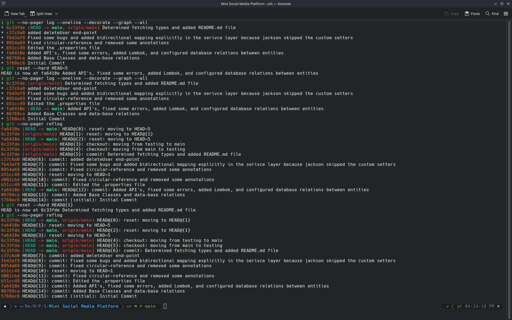

## Task 1
Below is the terminal execution tracing a path from a specific commit object down to a raw text file blob within the local object database:

```bash
# Step 1: Inspecting the commit object to find its top-level tree hash
❯ git cat-file -p HEAD
tree ea9eeefc2ca21318a03d49b045fba04aa12a6e4b
parent c37c6a02fb2385ec92b84835c724b0672c84fef9
author LD-RW <basheermazari4@gmail.com> 1778352491 +0300
committer LD-RW <basheermazari4@gmail.com> 1778352491 +0300

Determined fetching types and added README.md file

# Step 2: Querying that top-level tree object to see the directory contents
❯ git cat-file -p ea9eeefc2ca21318a03d49b045fba04aa12a6e4b
100644 blob 976e130ccf0b1cef576e6b29dedfea1abf1df41f    README.md
040000 tree a3a2668c1f3cc857ed3bb714ca0f475aabeffe02    media

# Step 3: Peeking inside the tree of media
❯ git cat-file -p a3a2668c1f3cc857ed3bb714ca0f475aabeffe02  
100644 blob 3b41682ac579fafb665abb4dfcdaa6aaaa712184    .gitattributes  
100644 blob 667aaef0c891a18c6177b09b53418bf59c6ab91f    .gitignore  
040000 tree 1cd3720d3ae2885194c7ae67129b513855c45ef3    .mvn  
100755 blob bd8896bf2217b46faa0291585e01ac1a3441a958    mvnw  
100644 blob 92450f93273470af42eeee491874afb2039b700a    mvnw.cmd  
100644 blob 06d78f0d2720de7e5e7093c478b26dd10b1ebf27    pom.xml  
040000 tree 12942e17cdcf2d5d8c238670b0410d8c29e3aac7    src
# Step 4 : Peeking inside a blob "pom.xml"
git cat-file -p 06d78f0d2720de7e5e7093c478b26dd10b1ebf27
#output will be the pom.xml file contents
```
- I see for each commit the objects it contains (trees / blobs), and when navigating inside the tree I saw the same thing for each object or subtree in that tree, also I see the permissions modes before the object's type. Finally when I go inside a blob I see it's contents


## Task 2
 
