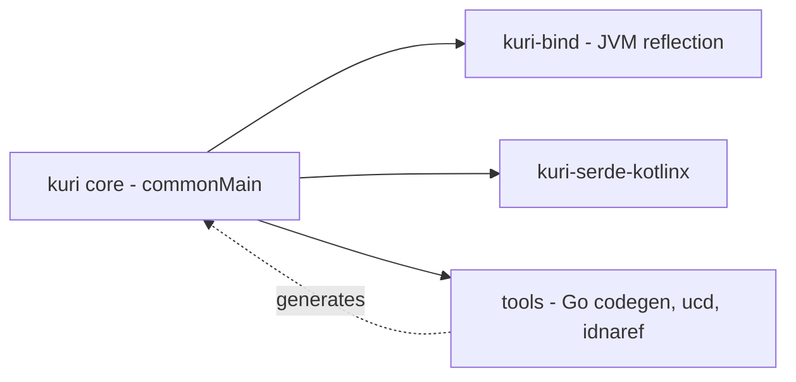

**Primary repository:** [dexpace/kuri](https://github.com/dexpace/kuri)
**Organization:** [github.com/dexpace](https://github.com/dexpace)
**Plan window:** 12 weeks, part-time alongside university

> Everything under "Observed" was read directly off GitHub on **9 Aug 2026**. Everything marked *My read* or written in the roadmap and risk sections is my own judgment and planning, not a claim about the project.

---

## 1. The project

### What dexpace is

dexpace is a small, Jordan-based developer-platform organization. Its profile states the intent plainly: a developer platform for building SDKs and developer tools — DX first, production always — working on typed, standards-faithful tooling that is correct by construction. It is explicitly an early-stage effort, led by **Omar Aljarrah** ([@OmarAlJarrah](https://github.com/OmarAlJarrah)).

**Observed — the ten public repositories, all MIT-licensed:**

| Repo | Language | What it is | Open issues / PRs |
|---|---|---|---|
| [morphic](https://github.com/dexpace/morphic) | Go | A compiler that generates idiomatic SDKs and docs from any API spec — OpenAPI, Smithy, TypeSpec, GraphQL. One IR, many targets. | 65 / 40 |
| [python-sdk](https://github.com/dexpace/python-sdk) | Python | Typed, transport-agnostic toolkit for Python HTTP client libraries — immutable request/response models, staged policy pipelines, auth, observability | 58 (15 help-wanted) / 8 |
| [java-sdk](https://github.com/dexpace/java-sdk) | Kotlin | Core components and tools for building and maintaining Java SDK libraries | 41 / 13 |
| [nodejs-sdk](https://github.com/dexpace/nodejs-sdk) | JavaScript | NodeJS SDK platform | 24 / 1 |
| [dotnet-sdk](https://github.com/dexpace/dotnet-sdk) | C# | .NET SDK toolkit | 4 / 0 |
| [go-sdk](https://github.com/dexpace/go-sdk) | Go | Go SDK toolkit | 0 / 0 |
| [kuri](https://github.com/dexpace/kuri) | Kotlin | URI/URL library (my primary target) | 7 / 4 |
| [styleguide](https://github.com/dexpace/styleguide) | — | dexpace codestyle across languages | 0 / 0 |
| [morphic-test-assets](https://github.com/dexpace/morphic-test-assets) | — | Assets for testing the morphic framework and CLI | 0 / 0 |
| [.github](https://github.com/dexpace/.github) | — | Org profile | — |

The shape of the org is coherent: `morphic` is the code generator, the `*-sdk` repos are the hand-built per-language runtimes it generates against, `styleguide` is the shared convention layer, and `kuri` is a foundational library the JVM/Kotlin side depends on for correct URL handling.

### What kuri does

**Observed (README):** kuri parses, builds, and normalizes URIs and URLs to the letter of the standards — RFC 3986, the WHATWG URL Standard, and UTS #46 for internationalized hosts. Parsing returns a result rather than throwing, values are immutable, and the API reads naturally from both Kotlin and Java. It runs on JVM, Android, JS, Wasm, and native. It's published to Maven Central as `org.dexpace:kuri` at `0.1.0`, with the API not yet frozen (`0.x`).

The problem statement, in the project's own framing: URL parsing looks trivial and almost never is. RFC 3986 and the WHATWG URL Standard are *different specs with different rules*, and when two parts of a system read the same URL differently, that gap becomes an SSRF filter bypass, an origin mix-up, or a poisoned cache key. The JVM's built-ins don't close it — `java.net.URI` is specified against the superseded RFC 2396, `java.net.URL` barely validates and its `equals()` makes a blocking DNS call, and neither exists off the JVM. Kotlin Multiplatform has no URL type in its stdlib at all, so shared code either drops to a JVM-only parser or reimplements parsing per platform and drifts.

Three artifacts: **`kuri`** (the core engine — `Url`/`Uri` models, parsing, building, query API, `Percent`/`Idn`/`Schemes` utilities), **`kuri-bind`** (JVM-only, maps an annotated request object onto a builder via Kotlin reflection), and **`kuri-serde-kotlinx`** (kotlinx.serialization bridge).

**Who uses it, or could:** JVM, Android, and Kotlin Multiplatform developers who need one URL behavior across targets; authors of HTTP clients and SDKs — which is exactly dexpace's own `java-sdk` and `morphic` Kotlin output; and any code doing security-sensitive URL validation where the RFC-vs-WHATWG gap is the actual attack surface. *My read:* the security angle is what makes this more than a utility library — a parser bug here is a vulnerability in a downstream service, not a cosmetic defect.

### Who maintains it, and how I'll use that

**Observed:** Omar Aljarrah leads dexpace and is the author of all 7 currently open `kuri` issues and of the open PRs #81 and #149. **Context I'm bringing:** he is a Software Development Engineer II at Expedia Group in Amman, and he's my brother.

I'm treating that deliberately. I do **not** want structured mentorship at this stage — the value of this project for me is precisely in reading unfamiliar code without a guide and forming my own hypotheses before asking anything. What the relationship actually buys me is a *low-latency unblocking channel*: when I've spent real effort on something and hit a wall that's project-specific rather than knowledge-specific (why a design went one way, whether a spec ambiguity is intentional, whether a change is in scope), I can get an answer in hours instead of waiting a week on an issue thread. My rule for myself: no question until I can state what I tried, what I expected, and what I observed.

---

## 2. Why this project, for me

I want to be a strong backend engineer, and the specific gap between where I am and that is not "writing more code" — it's working inside a codebase I didn't design, to a standard I didn't set. kuri is unusually well suited to closing that gap, for reasons that are concrete:

**The correctness bar is enforced by machine, not by taste.** `./gradlew build` runs the full quality gate: ktlint, detekt, Kotlin `allWarningsAsErrors`, explicit-API strict mode, the binary-compatibility validator (`apiCheck`), and Kover coverage floors of 99% line on `kuri` and `kuri-bind`. A public-API change must commit the regenerated `api/` snapshot in the same commit. I cannot merge sloppy work here even if I want to. That is exactly the production discipline I don't get from coursework or personal projects, and it teaches ABI stability and coverage thinking as a side effect.

**There is a written specification to reason against.** `docs/SPEC.md` is a normative behavior spec — character repertoire, encoding matrix, host pipeline, parsing algorithm, resolution, query model, error model — and behavior changes are expected to be grounded in the relevant standard and reflected there. So "is this a bug?" becomes a question I answer by reading RFC 3986 or the WHATWG URL spec, not by guessing. Learning to derive correct behavior from a specification is a durable skill; it's the thing that separates engineers who implement protocols from engineers who consume libraries.

**The domain is genuinely hard in an instructive way.** State-machine parsing, percent-encoding sets, IDNA/UTS-46 host processing, Unicode normalization, dot-segment resolution, generated lookup tables. This is systems-flavored work with real security consequences, and it overlaps with what I've been studying separately around performance and correctness under adversarial input.

**It's polyglot and multi-target in a useful way.** Kotlin Multiplatform in `commonMain`, Java interop as a first-class constraint, and a Go toolchain under `tools/` that generates the committed Kotlin tables. Contributing across that boundary means learning how a build pipeline actually produces source, not just consumes it.

**The org gives me somewhere to go next.** `python-sdk` alone has 15 issues tagged as needing help, and `morphic` is the most active repo in the org. Once I've earned some review trust on kuri, the same conventions (MIT, conventional commits, shared styleguide) carry across — so a contribution record here compounds instead of resetting.

---

## 3. Initial issues — my first three targets

**Observed:** `kuri` has exactly 7 open issues, all opened by the maintainer. There is no `RFCs/` directory and no GitHub Discussions on the repo — design discussion happens in issues, and two of the seven (#32, #10) are explicitly design/exploration issues rather than defects.

One I deliberately **did not** pick: [#102](https://github.com/dexpace/kuri/issues/102) (the broken `#standards` README anchor) is the smallest issue in the repo, but the maintainer already has [PR #149](https://github.com/dexpace/kuri/pull/149) open against it. Taking it would be duplicate work.

### Target 1 — [#21 · test: add Go unit tests for the codegen, idnaref, and ucd packages](https://github.com/dexpace/kuri/issues/21)
`enhancement` · opened 30 Jun 2026

**What it involves.** The Go code under `tools/` has no tests at all — `go test ./...` reports "no test files" for every package. Three load-bearing packages: `tools/internal/ucd` parses the Unicode Character Database, `tools/internal/idnaref` is the reference implementation that derives the IDNA known-failures baseline, and `tools/internal/codegen` emits the committed Kotlin lookup tables and conformance fixtures. A bug in any of them silently corrupts generated data. The issue asks for unit tests over small fixtures and for `go test ./...` to be wired into the contributor workflow.

**Why I selected it.** It's decomposable — I can land one package's tests as one PR — and it lets me learn the codebase from the generator side, which is the layer that explains *why* the Kotlin tables look the way they do. Test-only changes also can't break the public API, so my first PR carries low risk for the maintainer to review.

*Caveat I checked:* [PR #162](https://github.com/dexpace/kuri/pull/162) by @AhmadAL-Quraan already covers `internal/ucd`. **So my scope is `codegen` and `idnaref`** — and #162 doubles as a worked example of the conventions expected in this repo.

**What I'd learn.** Go testing with table-driven tests and golden files; the UCD data format; Punycode, NFC, ContextJ and CheckBidi from the reference-implementation side; and byte-stable codegen — how a project guarantees that regenerating checked-in source produces identical output.

### Target 2 — [#100 · ci: docs.yml concurrency comment contradicts `cancel-in-progress: false`](https://github.com/dexpace/kuri/issues/100)
`documentation` · opened 16 Jul 2026

**What it involves.** `.github/workflows/docs.yml` carries a comment saying a newer push to `main` supersedes an in-flight deploy, while the config directly below it (`cancel-in-progress: false`) does the opposite — the newer run queues behind the in-flight one. Real consequence: two commits in quick succession publish stale content briefly, and anyone debugging that is misdirected by the comment. The fix is a decision — correct the comment to describe queue-behind behavior, or flip the flag to `true` if superseding is actually intended.

**Why I selected it.** It's a genuinely small change that requires me to *make and defend a judgment* rather than just apply a diff, which is a better first conversation with a maintainer than a typo fix.

*Caveat I checked:* `docs.yml` does not exist on `main` yet — it arrives with [PR #81](https://github.com/dexpace/kuri/pull/81) (Astro + Starlight docs site), still open. So this is **gated on #81 merging**, and I'll confirm before starting rather than assume.

**What I'd learn.** GitHub Actions concurrency groups and the Pages deploy model, and — more valuably — how to write a PR whose argument is about intent rather than syntax.

### Target 3 — [#42 · kuri-bind: optional `java.lang.reflect`-native member scanner](https://github.com/dexpace/kuri/issues/42)
opened 7 Jul 2026

**What it involves.** `kuri-bind` uses `kotlin-reflect` as its single member-discovery mechanism, which drags that dependency onto the classpath even for consumers whose request objects are plain Java. A `java.lang.reflect`-native scanner would read bean getters (`getX`/`isX`), fields, and record components directly. Crucially, the issue notes **the `MemberScanner` interface already exists as the seam** — the binder engine is written against it, so a second implementation is what's needed. Open questions remain about selection strategy (classpath probe, explicit option, or separate artifact).

**Why I selected it.** This is my step up from test/docs work to a real feature, and it's scoped by an existing abstraction rather than open-ended. It's also a dependency-footprint problem, which is a very real production concern I haven't had to think about before.

**What I'd learn.** Java reflection versus Kotlin reflection and where their views of a class diverge; designing to an existing interface seam; JVM records and bean conventions; optional-dependency strategies; and the coverage/API-snapshot discipline that a non-trivial change triggers.

## 5. Risks and how I adapt

**The maintainer is slow or unavailable.** Omar has a full-time SDE II role; review latency is the default risk, not the exception. *Adaptation:* never have only one thing in flight. While a PR waits, I move to the next scoped item — the roadmap is deliberately built from independent slices (`codegen`, then `idnaref`, then `#42`) so nothing blocks on the previous merge. If a PR sits more than two weeks, I ping once in-thread with a short status summary, then keep working. Because he's my brother I could escalate out-of-band, but I'll reserve that for genuine blockers so it stays a real signal.

**An issue is much larger than it looks.** #42 is the likely candidate — "implement the seam" may surface annotation-site resolution problems the issue only gestures at. *Adaptation:* timebox investigation to one week. If it overruns, I post my findings in the issue as a written spike — that's a real contribution even if no code lands — and split the work: ship the scanner for the shapes it handles cleanly (records and bean getters), and file the hard cases as follow-ups. Half a feature, well-bounded and documented, beats a stalled branch.

**My proposed design is rejected.** Realistic on #100 and near-certain on parts of #32, where the maintainer holds context I don't. *Adaptation:* propose in the issue thread *before* writing code, so rejection costs a comment rather than a week. And treat rejection as data: the reasoning behind a "no" here is usually a spec constraint or a compatibility constraint, and writing that down is more valuable than the PR would have been.

**I can't understand a part of the codebase.** The IDNA/UTS-46 stack and the WHATWG state machine are the obvious candidates. *Adaptation:* go to the source spec rather than around it — UTS #46 and the WHATWG URL Standard, plus the conformance fixtures the repo already vendors, which are effectively executable documentation. Writing a failing test that pins down what I *don't* understand converts confusion into a concrete artifact. Only after that do I ask, with the failing test attached.

**Dependencies and external blockers.** #100 is explicitly gated on PR #81. Toolchain friction (JDK 21, Kotlin/Native or Wasm targets on my machine) could also cost days. *Adaptation:* verify the gate in week 1–2 rather than week 5. If #81 hasn't merged by then, #100 comes off the plan and I substitute an additional `tools/` or docs slice. For toolchain problems, fall back to running the JVM target only for iteration and let CI validate the other targets.

**Someone else takes the issue first.** Already a live risk — @AhmadAL-Quraan took `ucd` off #21, and the maintainer took #102 himself. *Adaptation:* comment to claim scope before starting, check open PRs at the beginning of every work session, and prefer decomposable issues where I can take a slice nobody else has. If I'm pre-empted mid-work, the fallback is always the same: I've read that code now, so I pivot to the nearest adjacent issue rather than starting over cold.

**Scope drift from university.** Exam weeks will eat entire weeks. *Adaptation:* the roadmap has slack built into weeks 5–7 and 11–12. If I lose two weeks, #42 becomes a design comment plus a partial PR rather than a merged feature, and the cross-repo work in week 12 is the first thing cut.

---

## Statement of intent

I'm contributing across the dexpace repositories with **kuri** as my primary project. I start with three concrete issues — [#21](https://github.com/dexpace/kuri/issues/21) (Go tests for `codegen` and `idnaref`), [#100](https://github.com/dexpace/kuri/issues/100) (CI concurrency correctness), and [#42](https://github.com/dexpace/kuri/issues/42) (a `java.lang.reflect`-native member scanner for `kuri-bind`) — and progress toward the parser and architecture work in [#32](https://github.com/dexpace/kuri/issues/32) and [#10](https://github.com/dexpace/kuri/issues/10) over twelve weeks. I work independently by default, using Omar as a project-specific resource when I'm genuinely blocked, not as a formal mentor.
