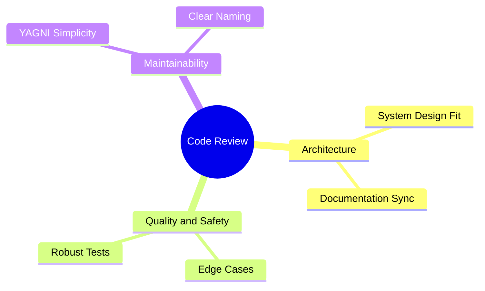
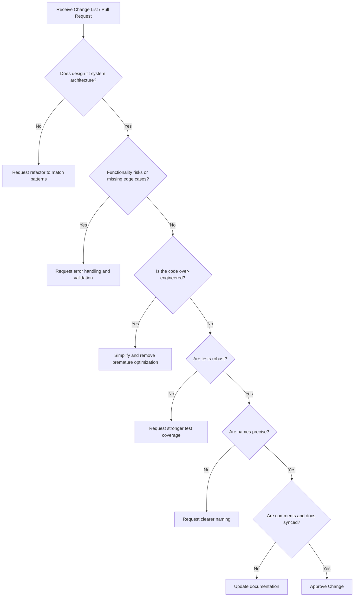

> A systematic framework for reviewing code changes based on engineering standards.

---

## Code Review Overview

## Mind Map

## Review Workflow

# The 8 Vectors of Code Review

## 1. Design (System Architecture)

**Core Question**

> Does this change fit naturally into the existing system?

**Principle**

Code should follow existing architecture and patterns.

**Red Flags**

- [ ]  Duplicate object creation
- [ ]  Bypassing existing database/network layers
- [ ]  Introducing conflicting dependencies

---

## 2. Functionality & Edge Cases

**Core Question**

> Does the code behave correctly in all realistic situations?

### Check:

- [ ]  Null / empty values
- [ ]  Boundary values
- [ ]  Negative numbers
- [ ]  Overflow cases
- [ ]  Race conditions
- [ ]  Thread safety
- [ ]  Network failures
- [ ]  Database failures

---

## 3. Complexity & Over-Engineering

**Core Question**

> Is this the simplest solution for the current problem?

**YAGNI**

Avoid building solutions for problems that do not exist.

> [!TIP]  
> Simple code solving complex problems is better than complex code solving simple problems.

---

## 4. Test Coverage

**Core Question**

> Do tests prove the code works beyond the happy path?

Check:

- [ ]  Edge cases
- [ ]  Failure scenarios
- [ ]  Exception handling
- [ ]  Branch coverage
- [ ]  Meaningful assertions

---

## 5. Naming Precision

**Core Question**

> Do names clearly explain intent?

Avoid:

❌ `UserData`  
✅ `UserSession`

❌ `Helper`  
✅ `TaxCalculator`

❌ `Manager` / `Info`

---

## 6. Intent-Driven Comments

**Core Question**

> Does the comment explain why, not what?

Good comments:

- Business decisions
- Trade-offs
- Complex reasoning

Bad comments:

- Explaining obvious code

---

## 7. Style Guide Separation

**Core Question**

> Does the code follow team conventions?

Rules:

- Use linters for formatting
- Separate style debates from design reviews
- Follow project standards

---

## 8. Documentation Sync

Check that updates exist for:

- [ ]  API documentation
- [ ]  README files
- [ ]  Architecture diagrams
- [ ]  Configuration examples

---

# Quick Review Table

|Area|Look For|Action|
|---|---|---|
|Design|Architecture fit|Request refactor|
|Functionality|Edge cases|Add validation|
|Complexity|Unnecessary abstraction|Simplify|
|Tests|Strong assertions|Add tests|
|Naming|Clear intent|Rename|
|Comments|Explain why|Improve comments|
|Style|Team conventions|Follow rules|
|Docs|Updated references|Sync docs|
