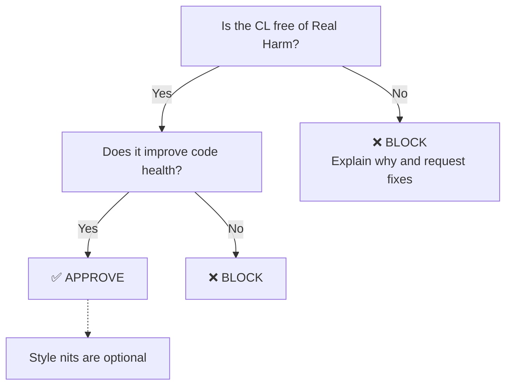

#Progamming #software_engineering #git 
## Core Philosophy
The guiding principle of Google's code review process is **incremental improvement over perfection**. 

> [!IMPORTANT]
> **The Golden Rule:** Reviewers should favor approving a Change List (CL) once it is in a state where it definitely improves the overall code health of the system being worked on, even if the CL isn’t perfect.

The core question every reviewer must ask is: **"Is the codebase better with this merged than without it?"**

---

## Technical Glossary

| Term | Definition | Impact / Significance |
| :--- | :--- | :--- |
| **Change List (CL)** | Google's term for a Pull Request (PR). A bundle of code changes proposed to the codebase. | The atomic unit of review and deployment. |
| **Code Health** | The maintainability, readability, test coverage, and architectural cleanliness of a system. | Determines long-term developer velocity and system stability. |
| **Real Harm** | Structural regressions, missing tests, security vulnerabilities, dead code, or broken logic. | The only valid justification for blocking a code change under this standard. |
| **Bikeshedding** | Wasting time arguing over trivial, subjective details (e.g., naming styles, code formatting). | Drastically reduces engineering velocity and harms team morale. |

---

## The Decision Engine: Approve vs. Block

Here is a cleaner Markdown redraw as a flowchart:

### When to Approve
* The core bug is fixed or the feature functions correctly.
* The change includes appropriate automated tests.
* The code is readable, even if it isn't how *you* would have written it.
* **Action:** Merge the code. Add any minor stylistic suggestions as **optional notes (Nits)**.

### When to Block
* **Architectural Problems:** Violates separation of concerns, introduces circular dependencies, or breaks design patterns.
* **Untested Changes:** Modifies critical logic without updating or adding tests.
* **Dead Code / Premature Abstractions:** Adds features or code components with no current caller ("YAGNI" - You Aren't Gonna Need It).
* **Action:** Halt the merge, clearly explain the technical risk, and provide an actionable path to resolution.

---

## Key Takeaways for the Team

* **Velocity is a Feature:** Holding up a CL for minor formatting issues delays value delivery and creates massive branch-merge conflicts later.
* **Fix Code Style with Tooling:** Don't waste human intelligence on linting. Use automated tools (e.g., Prettier, Spotless, GoFmt) to handle code formatting before the review stage.
* **Be Constructive:** If you must block a change, you owe the author a clear, objective explanation of the **real harm** the change causes.